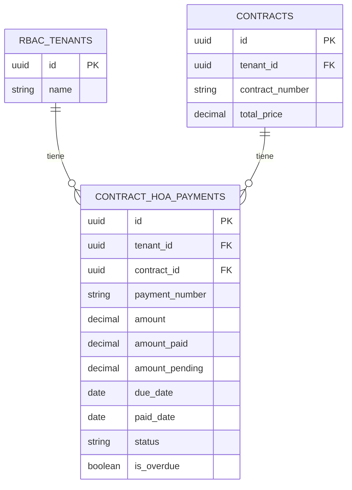
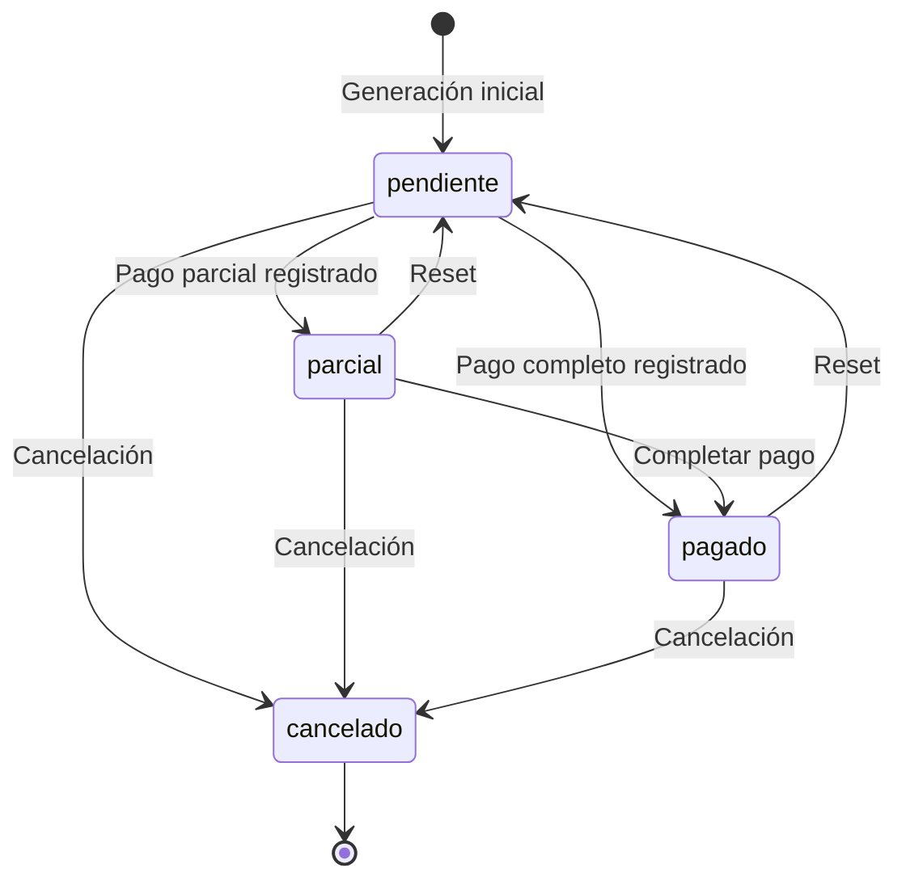

# Documento de Diseño: Sistema de Pagos HOA de Contratos

## Overview

El sistema de pagos HOA (Homeowners Association) permite gestionar pagos mensuales de asociación de propietarios de forma independiente a los pagos regulares del contrato. Este sistema replica la funcionalidad existente de pagos de contratos pero mantiene una separación clara en la base de datos y lógica de negocio.

### Objetivos del Sistema

- Generar automáticamente pagos HOA mensuales para contratos
- Registrar pagos completos y parciales de HOA
- Mantener estadísticas consolidadas de pagos HOA
- Gestionar el ciclo de vida completo de pagos HOA (crear, actualizar, cancelar, eliminar, resetear)
- Marcar automáticamente pagos vencidos
- Validar que solo exista un pago parcial activo por contrato

### Alcance

El sistema cubre:
- Generación automática de pagos HOA mensuales
- Registro y actualización de pagos HOA
- Consulta de pagos y estadísticas
- Gestión de estados de pago (pendiente, parcial, pagado, cancelado, vencido)
- Validación de reglas de negocio (pago parcial único)
- API REST completa para operaciones CRUD

El sistema NO cubre:
- Integración con pasarelas de pago externas
- Generación de facturas o recibos
- Notificaciones automáticas de vencimiento
- Cálculo de intereses moratorios

## Architecture

### Arquitectura de Capas

El sistema sigue una arquitectura de tres capas estándar de NestJS:

```
┌─────────────────────────────────────────┐
│         Controller Layer                │
│  (hoa-payments.controller.ts)           │
│  - Manejo de HTTP requests              │
│  - Validación de DTOs                   │
│  - Guards de autenticación/permisos     │
└─────────────────────────────────────────┘
                  ↓
┌─────────────────────────────────────────┐
│         Service Layer                   │
│  (hoa-payments.service.ts)              │
│  - Lógica de negocio                    │
│  - Validaciones de reglas               │
│  - Orquestación de operaciones          │
└─────────────────────────────────────────┘
                  ↓
┌─────────────────────────────────────────┐
│         Data Layer                      │
│  (contract-hoa-payment.entity.ts)       │
│  - Mapeo ORM con TypeORM                │
│  - Definición de esquema                │
│  - Relaciones entre entidades           │
└─────────────────────────────────────────┘
```

### Integración con Módulo de Contratos

El sistema de pagos HOA se integra como un submódulo dentro del módulo de contratos existente:

```
contracts/
├── contracts.module.ts (importa HoaPaymentsModule)
├── contracts.service.ts
├── contracts.controller.ts
├── contract-payments/ (pagos regulares existentes)
│   ├── payments.service.ts
│   ├── payments.controller.ts
│   └── dto/
└── contract-hoa-payments/ (nuevo submódulo)
    ├── hoa-payments.module.ts
    ├── hoa-payments.service.ts
    ├── hoa-payments.controller.ts
    └── dto/
```

### Patrón de Diseño

El sistema utiliza el patrón Repository proporcionado por TypeORM para acceso a datos, y el patrón Service Layer para encapsular la lógica de negocio.

## Components and Interfaces

### 1. Entity: ContractHoaPayment

**Ubicación:** `src/entities/contracts/contract-hoa-payment.entity.ts`

**Responsabilidad:** Representa un pago HOA individual en la base de datos.

```typescript
@Entity('contract_hoa_payments')
export class ContractHoaPayment {
  @PrimaryGeneratedColumn('uuid')
  id: string;

  @Column()
  tenant_id: string;

  @Column()
  contract_id: string;

  @Column({ length: 50 })
  payment_number: string;

  @Column({ type: 'decimal', precision: 15, scale: 2 })
  amount: number;

  @Column({ type: 'decimal', precision: 15, scale: 2, default: 0 })
  amount_paid: number;

  @Column({ type: 'decimal', precision: 15, scale: 2 })
  amount_pending: number;

  @Column({ type: 'date' })
  due_date: Date;

  @Column({ type: 'date', nullable: true })
  paid_date: Date | null;

  @Column({ type: 'date', nullable: true })
  first_partial_payment_date: Date | null;

  @Column({ length: 50, nullable: true })
  payment_method: string | null;

  @Column({
    type: 'enum',
    enum: ['pagado', 'pendiente', 'parcial', 'cancelado'],
    default: 'pendiente',
  })
  status: string;

  @Column({ type: 'boolean', default: false })
  is_overdue: boolean;

  @Column({ type: 'text', nullable: true })
  notes: string | null;

  @CreateDateColumn()
  created_at: Date;

  @UpdateDateColumn()
  updated_at: Date;

  // Relations
  @ManyToOne(() => RBACTenant, { onDelete: 'CASCADE' })
  @JoinColumn({ name: 'tenant_id' })
  tenant: RBACTenant;

  @ManyToOne(() => Contract, { onDelete: 'RESTRICT' })
  @JoinColumn({ name: 'contract_id' })
  contract: Contract;
}
```

### 2. Service: HoaPaymentsService

**Ubicación:** `src/api/contracts/contract-hoa-payments/hoa-payments.service.ts`

**Responsabilidad:** Implementa toda la lógica de negocio para gestión de pagos HOA.

**Métodos principales:**

```typescript
class HoaPaymentsService {
  // Generación de pagos
  generateHoaPayments(tenantId: string, contractId: string, dto: GenerateHoaPaymentsDto): Promise<ContractHoaPayment[]>
  
  // Consultas
  getContractHoaPayments(tenantId: string, contractId: string): Promise<ContractHoaPayment[]>
  getHoaPayment(tenantId: string, paymentId: string): Promise<ContractHoaPayment>
  getHoaPaymentStats(tenantId: string, contractId: string): Promise<HoaPaymentStatsDto>
  
  // Registro de pagos
  recordHoaPayment(tenantId: string, paymentId: string, dto: RecordHoaPaymentDto): Promise<ContractHoaPayment>
  
  // Actualizaciones
  updateHoaPayment(tenantId: string, paymentId: string, dto: UpdateHoaPaymentDto): Promise<ContractHoaPayment>
  
  // Operaciones especiales
  cancelHoaPayment(tenantId: string, paymentId: string): Promise<ContractHoaPayment>
  resetHoaPayment(tenantId: string, paymentId: string): Promise<ContractHoaPayment>
  deleteHoaPayment(tenantId: string, paymentId: string): Promise<void>
  markOverdueHoaPayments(tenantId: string): Promise<number>
}
```

### 3. Controller: HoaPaymentsController

**Ubicación:** `src/api/contracts/contract-hoa-payments/hoa-payments.controller.ts`

**Responsabilidad:** Expone endpoints REST y maneja autenticación/autorización.

**Endpoints:**

| Método | Ruta | Descripción | Permiso |
|--------|------|-------------|---------|
| POST | `/tenant/contracts/:contractId/hoa-payments/generate` | Generar pagos HOA | Contract:Create |
| GET | `/tenant/contracts/:contractId/hoa-payments` | Listar pagos HOA | Contract:Read |
| GET | `/tenant/contracts/:contractId/hoa-payments/stats` | Obtener estadísticas | Contract:Read |
| GET | `/tenant/contracts/:contractId/hoa-payments/:paymentId` | Obtener pago específico | Contract:Read |
| PUT | `/tenant/contracts/:contractId/hoa-payments/:paymentId` | Actualizar pago | Contract:Update |
| POST | `/tenant/contracts/:contractId/hoa-payments/:paymentId/pay` | Registrar pago | Contract:Update |
| POST | `/tenant/contracts/:contractId/hoa-payments/:paymentId/cancel` | Cancelar pago | Contract:Update |
| POST | `/tenant/contracts/:contractId/hoa-payments/:paymentId/reset` | Resetear pago | Contract:Update |
| DELETE | `/tenant/contracts/:contractId/hoa-payments/:paymentId` | Eliminar pago | Contract:Delete |
| POST | `/tenant/contracts/:contractId/hoa-payments/mark-overdue` | Marcar vencidos | Contract:Update |

### 4. DTOs (Data Transfer Objects)

**Ubicación:** `src/api/contracts/contract-hoa-payments/dto/`

#### GenerateHoaPaymentsDto
```typescript
export class GenerateHoaPaymentsDto {
  @IsDateString()
  start_date: string;

  @IsDateString()
  end_date: string;

  @IsNumber()
  @Min(0.01)
  monthly_amount: number;
}
```

#### RecordHoaPaymentDto
```typescript
export class RecordHoaPaymentDto {
  @IsNumber()
  @Min(0.01)
  amount: number;

  @IsDateString()
  payment_date: string;

  @IsString()
  payment_method: string;

  @IsOptional()
  @IsString()
  reference_number?: string;

  @IsOptional()
  @IsString()
  notes?: string;
}
```

#### UpdateHoaPaymentDto
```typescript
export class UpdateHoaPaymentDto {
  @IsOptional()
  @IsNumber()
  @Min(0)
  amount_paid?: number;

  @IsOptional()
  @IsDateString()
  due_date?: string;

  @IsOptional()
  @IsDateString()
  paid_date?: string;

  @IsOptional()
  @IsString()
  payment_method?: string;

  @IsOptional()
  @IsString()
  notes?: string;
}
```

#### HoaPaymentStatsDto
```typescript
export class HoaPaymentStatsDto {
  total_payments: number;
  paid_count: number;
  pending_count: number;
  partial_count: number;
  overdue_count: number;
  cancelled_count: number;
  total_paid: number;
  total_pending: number;
  total_expected: number;
  partial_payment: {
    id: string;
    payment_number: string;
    amount_paid: number;
    amount_pending: number;
    due_date: Date;
  } | null;
}
```

### 5. Module: HoaPaymentsModule

**Ubicación:** `src/api/contracts/contract-hoa-payments/hoa-payments.module.ts`

```typescript
@Module({
  imports: [
    TypeOrmModule.forFeature([ContractHoaPayment, Contract]),
    RBACModule,
  ],
  providers: [HoaPaymentsService],
  controllers: [HoaPaymentsController],
  exports: [HoaPaymentsService],
})
export class HoaPaymentsModule {}
```

## Data Models

### Tabla: contract_hoa_payments

**Esquema de Base de Datos:**

```sql
CREATE TABLE contract_hoa_payments (
  id VARCHAR(36) PRIMARY KEY,
  tenant_id VARCHAR(36) NOT NULL,
  contract_id VARCHAR(36) NOT NULL,
  payment_number VARCHAR(50) NOT NULL,
  amount DECIMAL(15, 2) NOT NULL,
  amount_paid DECIMAL(15, 2) DEFAULT 0,
  amount_pending DECIMAL(15, 2) NOT NULL,
  due_date DATE NOT NULL,
  paid_date DATE NULL,
  first_partial_payment_date DATE NULL,
  payment_method VARCHAR(50) NULL,
  status ENUM('pagado', 'pendiente', 'parcial', 'cancelado') DEFAULT 'pendiente',
  is_overdue BOOLEAN DEFAULT FALSE,
  notes TEXT NULL,
  created_at TIMESTAMP DEFAULT CURRENT_TIMESTAMP,
  updated_at TIMESTAMP DEFAULT CURRENT_TIMESTAMP ON UPDATE CURRENT_TIMESTAMP,
  
  FOREIGN KEY (tenant_id) REFERENCES rbac_tenants(id) ON DELETE CASCADE,
  FOREIGN KEY (contract_id) REFERENCES contracts(id) ON DELETE RESTRICT,
  
  INDEX idx_tenant_id (tenant_id),
  INDEX idx_contract_id (contract_id),
  INDEX idx_due_date (due_date),
  INDEX idx_status (status)
);
```

### Campos y Tipos de Datos

| Campo | Tipo | Restricciones | Descripción |
|-------|------|---------------|-------------|
| id | UUID | PRIMARY KEY | Identificador único |
| tenant_id | UUID | NOT NULL, FK | Referencia al tenant |
| contract_id | UUID | NOT NULL, FK | Referencia al contrato |
| payment_number | VARCHAR(50) | NOT NULL | Número secuencial del pago |
| amount | DECIMAL(15,2) | NOT NULL | Monto mensual esperado |
| amount_paid | DECIMAL(15,2) | DEFAULT 0 | Monto pagado acumulado |
| amount_pending | DECIMAL(15,2) | NOT NULL | Monto pendiente por pagar |
| due_date | DATE | NOT NULL | Fecha de vencimiento (día 5) |
| paid_date | DATE | NULL | Fecha de pago real |
| first_partial_payment_date | DATE | NULL | Primera fecha de pago parcial |
| payment_method | VARCHAR(50) | NULL | Método de pago usado |
| status | ENUM | DEFAULT 'pendiente' | Estado del pago |
| is_overdue | BOOLEAN | DEFAULT FALSE | Indicador de vencimiento |
| notes | TEXT | NULL | Notas y historial |
| created_at | TIMESTAMP | AUTO | Fecha de creación |
| updated_at | TIMESTAMP | AUTO | Fecha de actualización |

### Relaciones



### Estados del Pago



## Error Handling

### Estrategia de Manejo de Errores

El sistema utiliza las excepciones estándar de NestJS para manejo de errores:

1. **NotFoundException (404)**: Cuando un recurso no existe
2. **BadRequestException (400)**: Cuando los datos de entrada son inválidos
3. **UnauthorizedException (401)**: Cuando falta autenticación
4. **ForbiddenException (403)**: Cuando faltan permisos

### Casos de Error Específicos

#### 1. Pagos ya generados
```typescript
if (existingPayments > 0) {
  throw new BadRequestException(
    'Los pagos HOA ya fueron generados para este contrato'
  );
}
```

#### 2. Pago no encontrado
```typescript
if (!payment) {
  throw new NotFoundException('Pago HOA no encontrado');
}
```

#### 3. Pago cancelado
```typescript
if (payment.status === 'cancelado') {
  throw new BadRequestException(
    'No se puede registrar un pago en un pago cancelado'
  );
}
```

#### 4. Pago parcial duplicado
```typescript
if (newStatus === 'parcial' && existingPartialPayments.length > 0) {
  throw new BadRequestException(
    `Ya existe un pago parcial en este contrato (Pago #${existingPartial.payment_number}). ` +
    `Complete ese pago primero antes de crear otro pago parcial.`
  );
}
```

#### 5. Validación de fechas
```typescript
if (new Date(end_date) <= new Date(start_date)) {
  throw new BadRequestException(
    'La fecha de fin debe ser posterior a la fecha de inicio'
  );
}
```

#### 6. Validación de montos
```typescript
if (isNaN(paymentAmount) || paymentAmount <= 0) {
  throw new BadRequestException(
    'El monto debe ser un número válido mayor que 0'
  );
}
```

### Formato de Respuesta de Error

```json
{
  "statusCode": 400,
  "message": "Ya existe un pago parcial en este contrato (Pago #3). Complete ese pago primero antes de crear otro pago parcial.",
  "error": "Bad Request"
}
```

### Logging

El sistema debe registrar:
- Errores de validación (nivel: warn)
- Excepciones no controladas (nivel: error)
- Operaciones críticas exitosas (nivel: info)

```typescript
this.logger.warn(`Intento de crear pago parcial duplicado: ${contractId}`);
this.logger.error(`Error al generar pagos HOA: ${error.message}`, error.stack);
this.logger.info(`Pagos HOA generados exitosamente: ${contractId}`);
```

## Testing Strategy

### Enfoque de Testing

El sistema requiere una estrategia de testing dual que combine:

1. **Unit Tests**: Para validar lógica de negocio específica, casos edge y condiciones de error
2. **Integration Tests**: Para validar la interacción entre capas y con la base de datos

### Unit Tests

Los unit tests deben enfocarse en:

#### Service Layer Tests
- Validación de reglas de negocio (pago parcial único)
- Cálculo correcto de montos (amount_paid, amount_pending)
- Transiciones de estado correctas
- Manejo de casos edge (montos negativos, fechas inválidas)
- Validación de errores específicos

**Ejemplo de casos de prueba:**

```typescript
describe('HoaPaymentsService', () => {
  describe('generateHoaPayments', () => {
    it('should generate payments for each month in range', async () => {
      // Test que genera pagos del 2024-01-01 al 2024-06-01
      // Verifica que se crean 6 pagos
    });

    it('should throw error if payments already exist', async () => {
      // Test que intenta generar pagos cuando ya existen
      // Verifica que lanza BadRequestException
    });

    it('should set due_date to 5th of each month', async () => {
      // Test que verifica que due_date es día 5
    });
  });

  describe('recordHoaPayment', () => {
    it('should update status to "pagado" when full amount paid', async () => {
      // Test pago completo
    });

    it('should update status to "parcial" when partial amount paid', async () => {
      // Test pago parcial
    });

    it('should throw error when creating second partial payment', async () => {
      // Test validación de pago parcial único
    });

    it('should throw error when payment is cancelled', async () => {
      // Test que no permite pagar un pago cancelado
    });
  });

  describe('resetHoaPayment', () => {
    it('should reset payment to pending state', async () => {
      // Test que resetea amount_paid a 0 y status a pendiente
    });

    it('should add reset note with date and amount', async () => {
      // Test que agrega nota de reseteo
    });
  });

  describe('markOverdueHoaPayments', () => {
    it('should mark only pending and partial payments as overdue', async () => {
      // Test que solo marca pendientes y parciales
    });

    it('should not mark paid or cancelled payments as overdue', async () => {
      // Test que no marca pagados o cancelados
    });
  });
});
```

#### Controller Layer Tests
- Validación de DTOs
- Autenticación y autorización
- Manejo de respuestas HTTP

#### DTO Validation Tests
- Validación de campos requeridos
- Validación de tipos de datos
- Validación de rangos (montos > 0)
- Validación de formatos (fechas)

### Integration Tests

Los integration tests deben validar:

#### Database Integration
- Creación correcta de registros en base de datos
- Actualización de registros existentes
- Eliminación de registros
- Integridad referencial (foreign keys)
- Índices funcionando correctamente

#### API Endpoint Tests
- Flujo completo de generación de pagos
- Flujo completo de registro de pago
- Flujo completo de actualización
- Flujo completo de cancelación y reseteo
- Validación de permisos en cada endpoint

**Ejemplo de casos de prueba de integración:**

```typescript
describe('HoaPayments API (e2e)', () => {
  it('POST /tenant/contracts/:id/hoa-payments/generate - should generate payments', () => {
    return request(app.getHttpServer())
      .post(`/tenant/contracts/${contractId}/hoa-payments/generate`)
      .set('Authorization', `Bearer ${token}`)
      .send({
        start_date: '2024-01-01',
        end_date: '2024-06-01',
        monthly_amount: 500.00
      })
      .expect(201)
      .expect((res) => {
        expect(res.body).toHaveLength(6);
        expect(res.body[0].amount).toBe(500.00);
      });
  });

  it('POST /tenant/contracts/:id/hoa-payments/:paymentId/pay - should record payment', () => {
    return request(app.getHttpServer())
      .post(`/tenant/contracts/${contractId}/hoa-payments/${paymentId}/pay`)
      .set('Authorization', `Bearer ${token}`)
      .send({
        amount: 250.00,
        payment_date: '2024-01-10',
        payment_method: 'transferencia'
      })
      .expect(200)
      .expect((res) => {
        expect(res.body.status).toBe('parcial');
        expect(res.body.amount_paid).toBe(250.00);
        expect(res.body.amount_pending).toBe(250.00);
      });
  });
});
```

### Test Coverage Goals

- **Service Layer**: 90%+ coverage
- **Controller Layer**: 85%+ coverage
- **DTOs**: 100% coverage (validaciones)
- **Overall**: 85%+ coverage

### Testing Tools

- **Jest**: Framework de testing principal
- **@nestjs/testing**: Utilidades de testing de NestJS
- **supertest**: Testing de endpoints HTTP
- **TypeORM**: In-memory database para tests

### Continuous Integration

Los tests deben ejecutarse automáticamente en:
- Cada commit (pre-commit hook)
- Cada pull request
- Antes de cada deployment

```bash
# Ejecutar todos los tests
npm run test

# Ejecutar tests con coverage
npm run test:cov

# Ejecutar tests e2e
npm run test:e2e
```

---

Este diseño proporciona una base sólida para implementar el sistema de pagos HOA de contratos, manteniendo consistencia con el sistema existente de pagos regulares mientras mantiene una separación clara de responsabilidades.
