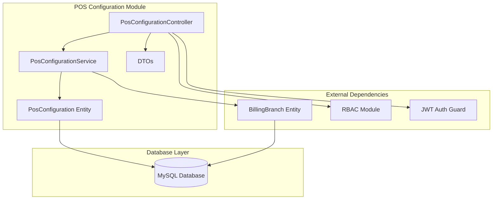
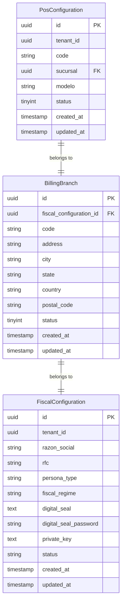

# Design Document: POS Configuration Module

## Overview

The POS Configuration module provides comprehensive equipment configuration management for Point of Sale systems within the Sinergy ERP platform. This module enables system administrators to configure, manage, and monitor POS equipment that will be utilized by the POS system module.

The module follows the established architectural patterns of the Sinergy ERP platform, implementing tenant isolation, RBAC-based access control, and RESTful API design. It integrates seamlessly with the existing billing branch infrastructure to ensure proper equipment-to-location associations.

### Key Features

- **Equipment Configuration Management**: Complete CRUD operations for POS equipment configurations
- **Branch Integration**: Seamless integration with the existing billing branches system
- **Tenant Isolation**: Multi-tenant architecture ensuring data separation
- **Access Control**: RBAC-based permissions for secure operations
- **Data Validation**: Comprehensive input validation and integrity checks
- **Audit Trail**: Automatic timestamping and change tracking

## Architecture

The POS Configuration module follows the established NestJS modular architecture pattern used throughout the Sinergy ERP platform:



### Module Structure

The module is organized following the established patterns:

- **Controller Layer**: Handles HTTP requests, authentication, and authorization
- **Service Layer**: Contains business logic and data operations
- **Entity Layer**: Defines the database schema and relationships
- **DTO Layer**: Provides data transfer objects for API contracts
- **Integration Layer**: Manages relationships with other modules

## Components and Interfaces

### PosConfiguration Entity

The core entity representing POS equipment configurations:

```typescript
@Entity('pos_configurations')
@Index('tenant_index', ['tenant_id'])
export class PosConfiguration {
  @PrimaryGeneratedColumn('uuid')
  id: string;

  @Column()
  @IsNotEmpty()
  tenant_id: string;

  @Column({ length: 255 })
  @IsNotEmpty()
  @IsString()
  code: string;

  @Column({ name: 'sucursal' })
  @IsNotEmpty()
  @IsUUID()
  sucursal: string;

  @Column({ length: 255, nullable: true })
  @IsOptional()
  @IsString()
  modelo?: string;

  @Column({ type: 'tinyint', default: 1 })
  @IsIn([0, 1])
  status: number;

  @ManyToOne(() => BillingBranch, { eager: true })
  @JoinColumn({ name: 'sucursal' })
  branch: BillingBranch;

  @CreateDateColumn({ type: 'timestamp' })
  created_at: Date;

  @UpdateDateColumn({ type: 'timestamp' })
  updated_at: Date;
}
```

### PosConfigurationService

The service layer implementing business logic:

```typescript
@Injectable()
export class PosConfigurationService {
  constructor(
    @InjectRepository(PosConfiguration)
    private repo: Repository<PosConfiguration>,
    @InjectRepository(BillingBranch)
    private branchRepo: Repository<BillingBranch>
  ) {}

  // Core CRUD operations with tenant isolation
  async create(dto: CreatePosConfigurationDto, tenantId: string): Promise<PosConfiguration>
  async findAll(tenantId: string, query?: QueryPosConfigurationDto): Promise<PaginatedPosConfigurationDto>
  async findOne(id: string, tenantId: string): Promise<PosConfiguration>
  async update(id: string, dto: UpdatePosConfigurationDto, tenantId: string): Promise<PosConfiguration>
  async remove(id: string, tenantId: string): Promise<void>
  
  // Branch validation
  private async validateBranch(sucursal: string, tenantId: string): Promise<void>
}
```

### PosConfigurationController

The controller layer handling HTTP requests:

```typescript
@UseGuards(JwtAuthGuard, PermissionGuard)
@Controller('tenant/pos-configurations')
@ApiTags('POS Configurations')
@ApiBearerAuth()
export class PosConfigurationController {
  constructor(private readonly service: PosConfigurationService) {}

  @Post()
  @RequirePermissions({ entityType: 'pos_configurations', action: 'Create' })
  create(@Body() dto: CreatePosConfigurationDto, @Req() req)

  @Get()
  @RequirePermissions({ entityType: 'pos_configurations', action: 'Read' })
  findAll(@Query() query: QueryPosConfigurationDto, @Req() req)

  @Get(':id')
  @RequirePermissions({ entityType: 'pos_configurations', action: 'Read' })
  findOne(@Param('id') id: string, @Req() req)

  @Put(':id')
  @RequirePermissions({ entityType: 'pos_configurations', action: 'Update' })
  update(@Param('id') id: string, @Body() dto: UpdatePosConfigurationDto, @Req() req)

  @Delete(':id')
  @RequirePermissions({ entityType: 'pos_configurations', action: 'Delete' })
  remove(@Param('id') id: string, @Req() req)
}
```

### Data Transfer Objects

#### CreatePosConfigurationDto
```typescript
export class CreatePosConfigurationDto {
  @IsNotEmpty()
  @IsString()
  @MaxLength(255)
  code: string;

  @IsNotEmpty()
  @IsUUID()
  sucursal: string;

  @IsOptional()
  @IsString()
  @MaxLength(255)
  modelo?: string;

  @IsOptional()
  @IsIn([0, 1])
  status?: number;
}
```

#### QueryPosConfigurationDto
```typescript
export class QueryPosConfigurationDto {
  @IsOptional()
  @IsNumber()
  @Min(1)
  page?: number;

  @IsOptional()
  @IsNumber()
  @Min(1)
  @Max(100)
  limit?: number;

  @IsOptional()
  @IsString()
  search?: string;

  @IsOptional()
  @IsIn([0, 1])
  status?: number;

  @IsOptional()
  @IsUUID()
  sucursal?: string;
}
```

#### UpdatePosConfigurationDto
```typescript
export class UpdatePosConfigurationDto extends PartialType(CreatePosConfigurationDto) {}
```

#### PaginatedPosConfigurationDto
```typescript
export class PaginatedPosConfigurationDto {
  data: PosConfiguration[];
  total: number;
  page: number;
  limit: number;
  totalPages: number;
  hasNext: boolean;
  hasPrev: boolean;
}
```

## Data Models

### Database Schema

The POS Configuration module introduces a single primary table with relationships to existing infrastructure:

```sql
CREATE TABLE pos_configurations (
  id VARCHAR(36) PRIMARY KEY,
  tenant_id VARCHAR(36) NOT NULL,
  code VARCHAR(255) NOT NULL,
  sucursal VARCHAR(36) NOT NULL,
  modelo VARCHAR(255) NULL,
  status TINYINT DEFAULT 1,
  created_at TIMESTAMP DEFAULT CURRENT_TIMESTAMP,
  updated_at TIMESTAMP DEFAULT CURRENT_TIMESTAMP ON UPDATE CURRENT_TIMESTAMP,
  
  INDEX tenant_index (tenant_id),
  INDEX branch_index (sucursal),
  FOREIGN KEY (sucursal) REFERENCES billing_branches(id) ON DELETE RESTRICT
);
```

### Entity Relationships



### Data Validation Rules

1. **Equipment Code**: Non-empty string, maximum 255 characters
2. **Branch Reference (sucursal)**: Valid UUID referencing existing billing branch
3. **Model (modelo)**: Optional string, maximum 255 characters when provided
4. **Status**: Integer value of 0 (inactive) or 1 (active)
5. **Tenant Isolation**: All operations must be scoped to authenticated user's tenant

## Correctness Properties

*A property is a characteristic or behavior that should hold true across all valid executions of a system-essentially, a formal statement about what the system should do. Properties serve as the bridge between human-readable specifications and machine-verifiable correctness guarantees.*
### Property Reflection

After analyzing all acceptance criteria, I identified several areas where properties can be consolidated to eliminate redundancy:

**Consolidation Areas:**
1. **Tenant Isolation Properties** (1.5, 2.1, 3.1, 4.1, 6.4): These can be combined into a comprehensive tenant isolation property
2. **Branch Validation Properties** (1.2, 3.2, 5.1): These can be combined into a single branch reference validation property
3. **Timestamp Properties** (1.4, 3.3): These can be combined into a single timestamp management property
4. **Referential Integrity Properties** (3.5, 5.3): These overlap and can be combined
5. **Validation Properties** (7.1, 7.2, 7.3, 7.4): These can be grouped into comprehensive input validation properties

**Unique Properties Retained:**
- UUID generation uniqueness (1.3)
- Search and filtering functionality (2.2, 2.5, 5.5)
- Pagination logic (2.3)
- Relationship loading (2.4, 5.2)
- CRUD operation completeness (4.3)
- Error handling (3.4, 4.2, 7.5)

### Property 1: Comprehensive Tenant Isolation

*For any* POS configuration operation (create, read, update, delete), the system SHALL ensure that all data access and modifications are strictly scoped to the authenticated user's tenant, preventing cross-tenant data exposure or modification.

**Validates: Requirements 1.5, 2.1, 3.1, 4.1, 6.4**

### Property 2: Branch Reference Validation

*For any* POS configuration creation or update that includes a sucursal field, the system SHALL validate that the sucursal references an existing billing branch within the same tenant and reject operations with invalid references.

**Validates: Requirements 1.2, 3.2, 5.1**

### Property 3: Automatic Timestamp Management

*For any* POS configuration, the system SHALL automatically set created_at on creation and update updated_at on any modification, ensuring timestamps accurately reflect record lifecycle.

**Validates: Requirements 1.4, 3.3**

### Property 4: UUID Generation Uniqueness

*For any* newly created POS configuration, the system SHALL assign a unique UUID identifier that follows proper UUID format and is distinct from all other configuration identifiers.

**Validates: Requirements 1.3**

### Property 5: Search and Filtering Accuracy

*For any* search query with filters (code, status, branch), the system SHALL return only configurations that match all specified criteria within the tenant scope, ordered by creation date in descending order.

**Validates: Requirements 2.2, 2.5, 5.5**

### Property 6: Pagination Consistency

*For any* paginated request, the system SHALL return results with correct pagination metadata (page, limit, total, hasNext, hasPrev) and enforce the maximum limit of 100 records per page.

**Validates: Requirements 2.3**

### Property 7: Relationship Loading Completeness

*For any* POS configuration retrieval, the system SHALL include complete associated branch information when the relationship is requested, ensuring data consistency and completeness.

**Validates: Requirements 2.4, 5.2**

### Property 8: CRUD Operation Completeness

*For any* delete operation on an existing POS configuration within the tenant scope, the system SHALL completely remove the record from the database, making it unavailable for subsequent queries.

**Validates: Requirements 4.3**

### Property 9: Error Handling for Invalid Operations

*For any* operation on non-existent POS configurations or cross-tenant access attempts, the system SHALL return appropriate error responses with descriptive messages and prevent unauthorized data access.

**Validates: Requirements 3.4, 4.2, 7.5**

### Property 10: Input Validation Completeness

*For any* POS configuration creation or update, the system SHALL validate all input fields (code as non-empty string, modelo as optional non-empty string, status as 0 or 1, sucursal as valid UUID) and reject invalid inputs with descriptive error messages.

**Validates: Requirements 7.1, 7.2, 7.3, 7.4, 7.5**

### Property 11: Configuration Field Completeness

*For any* successfully created POS configuration, the system SHALL ensure all required fields (id, tenant_id, code, sucursal, status, created_at, updated_at) are properly set and retrievable.

**Validates: Requirements 1.1**

## Error Handling

The POS Configuration module implements comprehensive error handling following the established patterns in the Sinergy ERP platform:

### Validation Errors

- **400 Bad Request**: Invalid input data, malformed UUIDs, missing required fields
- **422 Unprocessable Entity**: Business logic violations (invalid branch references, invalid status values)

### Authentication and Authorization Errors

- **401 Unauthorized**: Missing or invalid JWT token
- **403 Forbidden**: Insufficient RBAC permissions for the requested operation

### Resource Errors

- **404 Not Found**: Requested POS configuration does not exist or belongs to different tenant
- **409 Conflict**: Attempting to delete configuration referenced by active POS operations

### System Errors

- **500 Internal Server Error**: Database connection issues, unexpected system failures

### Error Response Format

All errors follow the standardized format:

```typescript
{
  "statusCode": number,
  "message": string | string[],
  "error": string,
  "timestamp": string,
  "path": string
}
```

### Branch Validation Error Handling

Special attention is given to branch reference validation:

```typescript
async validateBranch(sucursal: string, tenantId: string): Promise<void> {
  const branch = await this.branchRepo.findOne({
    where: { 
      id: sucursal,
      fiscal_configuration: { tenant_id: tenantId }
    },
    relations: ['fiscal_configuration']
  });
  
  if (!branch) {
    throw new BadRequestException(
      `Branch with ID ${sucursal} not found or does not belong to your organization`
    );
  }
}
```

## Testing Strategy

The POS Configuration module employs a comprehensive dual testing approach combining unit tests for specific scenarios and property-based tests for universal correctness guarantees.

### Property-Based Testing

The module uses **fast-check** library for property-based testing with the following configuration:

- **Minimum 100 iterations** per property test to ensure comprehensive input coverage
- **Custom generators** for POS configuration data, UUIDs, and tenant contexts
- **Property test tags** referencing design document properties

Each correctness property is implemented as a property-based test with the tag format:
**Feature: pos-configuration, Property {number}: {property_text}**

### Unit Testing Strategy

Unit tests focus on:

- **Specific examples**: Concrete scenarios demonstrating correct behavior
- **Edge cases**: Boundary conditions and error scenarios
- **Integration points**: Interactions with billing branches and RBAC systems
- **Mock-based testing**: External dependencies are mocked for isolation

### Test Categories

#### 1. Entity Tests
- Field validation and constraints
- Relationship mapping and eager loading
- Database schema compliance

#### 2. Service Tests
- Business logic validation
- Tenant isolation enforcement
- Branch reference validation
- CRUD operation completeness
- Error handling scenarios

#### 3. Controller Tests
- HTTP request/response handling
- Authentication and authorization
- Input validation and sanitization
- API contract compliance

#### 4. Integration Tests
- Database operations with real connections
- RBAC permission enforcement
- Branch relationship validation
- End-to-end workflow testing

### Test Data Management

- **Factories**: Generate realistic test data for configurations and branches
- **Fixtures**: Predefined data sets for consistent testing scenarios
- **Cleanup**: Automatic test data cleanup to prevent interference
- **Isolation**: Each test runs in isolated transaction context

### Coverage Requirements

- **Line Coverage**: Minimum 90% for service and controller layers
- **Branch Coverage**: Minimum 85% for all conditional logic
- **Property Coverage**: 100% of correctness properties must have corresponding tests
- **Integration Coverage**: All external dependencies must be tested

### Performance Testing

- **Load Testing**: Verify performance with large datasets (1000+ configurations)
- **Pagination Testing**: Ensure efficient pagination with various page sizes
- **Query Optimization**: Validate database query performance and indexing
- **Memory Testing**: Verify no memory leaks in long-running operations

The testing strategy ensures that the POS Configuration module maintains high reliability, security, and performance standards while providing comprehensive validation of both specific use cases and universal system properties.