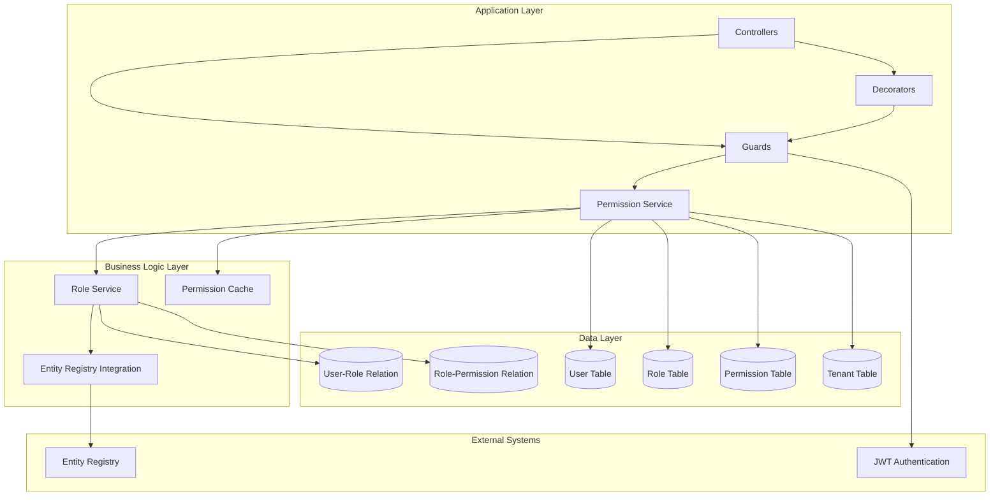

# Design Document: Role-Based Access Control System

## Overview

This document outlines the design for a comprehensive Role-Based Access Control (RBAC) system for a multi-tenant NestJS application. The system provides granular permission control over entities and actions while maintaining tenant isolation and supporting flexible role management.

The RBAC system follows a traditional model with Users, Roles, and Permissions, enhanced with multi-tenancy support and integration with an existing Entity Registry system. The design emphasizes performance, security, and maintainability while providing a seamless developer experience through guards and decorators.

## Architecture

### High-Level Architecture



### Multi-Tenant Architecture

The system implements tenant isolation at the data level, ensuring that roles and permissions are scoped to specific tenants. Each user can have different roles in different tenants, providing maximum flexibility for multi-tenant scenarios.

### Integration Points

- **Entity Registry**: Automatically discovers available entities for permission assignment
- **JWT Authentication**: Integrates with existing authentication to provide seamless authorization
- **TypeORM**: Leverages existing ORM infrastructure for data persistence
- **NestJS Guards**: Provides declarative authorization through decorators

## Components and Interfaces

### Core Entities

#### User Entity
```typescript
@Entity('users')
export class User {
  @PrimaryGeneratedColumn('uuid')
  id: string;

  @Column({ unique: true })
  email: string;

  @Column()
  hashedPassword: string;

  @OneToMany(() => UserRole, userRole => userRole.user)
  userRoles: UserRole[];

  @CreateDateColumn()
  createdAt: Date;

  @UpdateDateColumn()
  updatedAt: Date;
}
```

#### Tenant Entity
```typescript
@Entity('tenants')
export class Tenant {
  @PrimaryGeneratedColumn('uuid')
  id: string;

  @Column({ unique: true })
  name: string;

  @Column()
  subdomain: string;

  @OneToMany(() => Role, role => role.tenant)
  roles: Role[];

  @OneToMany(() => UserRole, userRole => userRole.tenant)
  userRoles: UserRole[];

  @CreateDateColumn()
  createdAt: Date;

  @UpdateDateColumn()
  updatedAt: Date;
}
```

#### Role Entity
```typescript
@Entity('roles')
export class Role {
  @PrimaryGeneratedColumn('uuid')
  id: string;

  @Column()
  name: string;

  @Column({ nullable: true })
  description: string;

  @Column({ default: false })
  isSystemRole: boolean;

  @ManyToOne(() => Tenant, tenant => tenant.roles)
  @JoinColumn({ name: 'tenant_id' })
  tenant: Tenant;

  @Column({ name: 'tenant_id' })
  tenantId: string;

  @OneToMany(() => UserRole, userRole => userRole.role)
  userRoles: UserRole[];

  @OneToMany(() => RolePermission, rolePermission => rolePermission.role)
  rolePermissions: RolePermission[];

  @CreateDateColumn()
  createdAt: Date;

  @UpdateDateColumn()
  updatedAt: Date;
}
```

#### Permission Entity
```typescript
@Entity('permissions')
export class Permission {
  @PrimaryGeneratedColumn('uuid')
  id: string;

  @Column()
  entityType: string;

  @Column()
  action: string;

  @Column({ nullable: true })
  description: string;

  @Column({ default: false })
  isSystemPermission: boolean;

  @OneToMany(() => RolePermission, rolePermission => rolePermission.permission)
  rolePermissions: RolePermission[];

  @CreateDateColumn()
  createdAt: Date;

  @UpdateDateColumn()
  updatedAt: Date;

  @Index(['entityType', 'action'], { unique: true })
  entityActionIndex: void;
}
```

#### Junction Tables
```typescript
@Entity('user_roles')
export class UserRole {
  @PrimaryGeneratedColumn('uuid')
  id: string;

  @ManyToOne(() => User, user => user.userRoles)
  @JoinColumn({ name: 'user_id' })
  user: User;

  @Column({ name: 'user_id' })
  userId: string;

  @ManyToOne(() => Role, role => role.userRoles)
  @JoinColumn({ name: 'role_id' })
  role: Role;

  @Column({ name: 'role_id' })
  roleId: string;

  @ManyToOne(() => Tenant, tenant => tenant.userRoles)
  @JoinColumn({ name: 'tenant_id' })
  tenant: Tenant;

  @Column({ name: 'tenant_id' })
  tenantId: string;

  @CreateDateColumn()
  createdAt: Date;

  @Index(['userId', 'roleId', 'tenantId'], { unique: true })
  userRoleTenantIndex: void;
}

@Entity('role_permissions')
export class RolePermission {
  @PrimaryGeneratedColumn('uuid')
  id: string;

  @ManyToOne(() => Role, role => role.rolePermissions)
  @JoinColumn({ name: 'role_id' })
  role: Role;

  @Column({ name: 'role_id' })
  roleId: string;

  @ManyToOne(() => Permission, permission => permission.rolePermissions)
  @JoinColumn({ name: 'permission_id' })
  permission: Permission;

  @Column({ name: 'permission_id' })
  permissionId: string;

  @CreateDateColumn()
  createdAt: Date;

  @Index(['roleId', 'permissionId'], { unique: true })
  rolePermissionIndex: void;
}
```

### Service Layer

#### Permission Service
```typescript
@Injectable()
export class PermissionService {
  constructor(
    @InjectRepository(Permission)
    private permissionRepository: Repository<Permission>,
    @InjectRepository(UserRole)
    private userRoleRepository: Repository<UserRole>,
    private cacheService: CacheService,
    private entityRegistryService: EntityRegistryService,
  ) {}

  async hasPermission(
    userId: string,
    tenantId: string,
    entityType: string,
    action: string,
  ): Promise<boolean>;

  async getUserPermissions(
    userId: string,
    tenantId: string,
  ): Promise<Permission[]>;

  async createPermission(
    entityType: string,
    action: string,
    description?: string,
  ): Promise<Permission>;

  async validateEntityType(entityType: string): Promise<boolean>;
}
```

#### Role Service
```typescript
@Injectable()
export class RoleService {
  constructor(
    @InjectRepository(Role)
    private roleRepository: Repository<Role>,
    @InjectRepository(UserRole)
    private userRoleRepository: Repository<UserRole>,
    @InjectRepository(RolePermission)
    private rolePermissionRepository: Repository<RolePermission>,
  ) {}

  async createRole(
    tenantId: string,
    name: string,
    description?: string,
  ): Promise<Role>;

  async assignRoleToUser(
    userId: string,
    roleId: string,
    tenantId: string,
  ): Promise<UserRole>;

  async assignPermissionToRole(
    roleId: string,
    permissionId: string,
  ): Promise<RolePermission>;

  async getUserRoles(userId: string, tenantId: string): Promise<Role[]>;

  async createSystemRoles(tenantId: string): Promise<Role[]>;
}
```

### Guard Implementation

#### Permission Guard
```typescript
@Injectable()
export class PermissionGuard implements CanActivate {
  constructor(
    private reflector: Reflector,
    private permissionService: PermissionService,
    private jwtService: JwtService,
  ) {}

  async canActivate(context: ExecutionContext): Promise<boolean> {
    const requiredPermissions = this.reflector.getAllAndOverride<
      RequiredPermission[]
    >(PERMISSIONS_KEY, [context.getHandler(), context.getClass()]);

    if (!requiredPermissions) {
      return true;
    }

    const request = context.switchToHttp().getRequest();
    const user = request.user;
    const tenantId = request.headers['x-tenant-id'] || user.currentTenantId;

    if (!user || !tenantId) {
      throw new UnauthorizedException('Authentication required');
    }

    for (const permission of requiredPermissions) {
      const hasPermission = await this.permissionService.hasPermission(
        user.id,
        tenantId,
        permission.entityType,
        permission.action,
      );

      if (!hasPermission) {
        throw new ForbiddenException(
          `Missing permission: ${permission.action} on ${permission.entityType}`,
        );
      }
    }

    return true;
  }
}
```

### Decorator Implementation

#### Permissions Decorator
```typescript
export interface RequiredPermission {
  entityType: string;
  action: string;
}

export const PERMISSIONS_KEY = 'permissions';

export const RequirePermissions = (
  ...permissions: RequiredPermission[]
) => SetMetadata(PERMISSIONS_KEY, permissions);

// Usage example:
@Controller('customers')
@UseGuards(JwtAuthGuard, PermissionGuard)
export class CustomersController {
  @Get()
  @RequirePermissions({ entityType: 'Customer', action: 'Read' })
  async findAll() {
    // Implementation
  }

  @Post()
  @RequirePermissions({ entityType: 'Customer', action: 'Create' })
  async create(@Body() createCustomerDto: CreateCustomerDto) {
    // Implementation
  }

  @Delete(':id')
  @RequirePermissions({ entityType: 'Customer', action: 'Delete' })
  async remove(@Param('id') id: string) {
    // Implementation
  }
}
```

## Data Models

### Entity Registry Integration

The system integrates with the existing Entity Registry to automatically discover available entities and their supported actions:

```typescript
@Injectable()
export class EntityRegistryService {
  private readonly supportedActions = [
    'Create',
    'Read',
    'Update',
    'Delete',
    'Export',
    'Import',
    'Download_Report',
    'Bulk_Update',
    'Bulk_Delete',
  ];

  async getAvailableEntities(): Promise<string[]> {
    // Integration with existing entity registry
    return ['User', 'Customer', 'Lead', 'Order', 'Product'];
  }

  async getSupportedActions(): Promise<string[]> {
    return this.supportedActions;
  }

  async validateEntityAction(
    entityType: string,
    action: string,
  ): Promise<boolean> {
    const entities = await this.getAvailableEntities();
    const actions = await this.getSupportedActions();
    
    return entities.includes(entityType) && actions.includes(action);
  }
}
```

### Permission Cache Strategy

To optimize performance, the system implements a multi-level caching strategy:

```typescript
@Injectable()
export class PermissionCacheService {
  constructor(
    @Inject(CACHE_MANAGER) private cacheManager: Cache,
  ) {}

  private getUserPermissionsCacheKey(userId: string, tenantId: string): string {
    return `user_permissions:${userId}:${tenantId}`;
  }

  async getUserPermissions(
    userId: string,
    tenantId: string,
  ): Promise<Permission[] | null> {
    const cacheKey = this.getUserPermissionsCacheKey(userId, tenantId);
    return await this.cacheManager.get(cacheKey);
  }

  async setUserPermissions(
    userId: string,
    tenantId: string,
    permissions: Permission[],
    ttl: number = 300, // 5 minutes
  ): Promise<void> {
    const cacheKey = this.getUserPermissionsCacheKey(userId, tenantId);
    await this.cacheManager.set(cacheKey, permissions, ttl);
  }

  async invalidateUserPermissions(
    userId: string,
    tenantId: string,
  ): Promise<void> {
    const cacheKey = this.getUserPermissionsCacheKey(userId, tenantId);
    await this.cacheManager.del(cacheKey);
  }
}
```

### System Role Templates

The system provides predefined role templates that are automatically created for new tenants:

```typescript
export interface RoleTemplate {
  name: string;
  description: string;
  permissions: Array<{
    entityType: string;
    actions: string[];
  }>;
}

export const SYSTEM_ROLE_TEMPLATES: RoleTemplate[] = [
  {
    name: 'Admin',
    description: 'Full access to all entities and actions',
    permissions: [
      {
        entityType: '*', // Wildcard for all entities
        actions: ['*'], // Wildcard for all actions
      },
    ],
  },
  {
    name: 'Operator',
    description: 'Read access to customers and leads, no user management',
    permissions: [
      {
        entityType: 'Customer',
        actions: ['Read', 'Update', 'Export', 'Download_Report'],
      },
      {
        entityType: 'Lead',
        actions: ['Read', 'Update', 'Create', 'Export', 'Download_Report'],
      },
    ],
  },
  {
    name: 'Viewer',
    description: 'Read-only access to basic entities',
    permissions: [
      {
        entityType: 'Customer',
        actions: ['Read'],
      },
      {
        entityType: 'Lead',
        actions: ['Read'],
      },
    ],
  },
];
```

## Correctness Properties

*A property is a characteristic or behavior that should hold true across all valid executions of a system—essentially, a formal statement about what the system should do. Properties serve as the bridge between human-readable specifications and machine-verifiable correctness guarantees.*

After analyzing the acceptance criteria, I've identified the following properties that can be combined and consolidated to eliminate redundancy:

**Property Reflection:**
- Properties 1.1 and 2.1 both test data association integrity and can be combined into a comprehensive data integrity property
- Properties 3.1 and 3.5 both test permission propagation and can be combined into a single permission inheritance property  
- Properties 7.1, 7.3, and 7.4 all test error handling and can be combined into a comprehensive error handling property
- Properties 6.2 and 2.5 both test validation against entity registry and can be combined
- Properties 9.2 and 9.3 both test caching behavior and can be combined into a single caching property

### Property 1: Tenant Isolation
*For any* tenant and any query for roles or permissions, the system should return only data belonging to that specific tenant and never include data from other tenants
**Validates: Requirements 1.2, 1.4**

### Property 2: Data Integrity and Association
*For any* role, permission, or user-role assignment created in the system, it should be properly associated with the correct tenant, entity type, and action as specified during creation
**Validates: Requirements 1.1, 2.1**

### Property 3: Permission Inheritance and Propagation
*For any* user assigned to a role, they should have all permissions associated with that role, and when role permissions are modified, all users with that role should immediately reflect the updated permissions
**Validates: Requirements 3.1, 3.5**

### Property 4: Authorization Enforcement
*For any* user attempting to perform an action on an entity, the system should grant access if and only if the user has the required permission for that action and entity type in the current tenant context
**Validates: Requirements 3.2, 3.3**

### Property 5: Multi-Tenant Role Support
*For any* user with roles in multiple tenants, permission checks should be evaluated based on their role in the specific tenant context being accessed
**Validates: Requirements 1.3, 3.4**

### Property 6: Entity Registry Integration and Validation
*For any* permission created or validated, the entity type and action should be verified against the Entity Registry, and new entities added to the registry should automatically become available for permission assignment
**Validates: Requirements 2.5, 6.1, 6.2, 6.3**

### Property 7: System Role Template Creation
*For any* new tenant created, the system should automatically create predefined role templates (Admin, Operator, Viewer) with their specified permissions
**Validates: Requirements 4.3**

### Property 8: Permission Caching Consistency
*For any* user's permissions that are cached, subsequent permission checks should use the cached data until expiration, and cache refresh should happen transparently without affecting authorization results
**Validates: Requirements 9.2, 9.3**

### Property 9: Comprehensive Error Handling
*For any* authorization failure, invalid permission assignment, or system error, the system should return appropriate error messages that clearly indicate the type of failure and missing permissions
**Validates: Requirements 7.1, 7.3, 7.4**

### Property 10: Audit Trail Completeness
*For any* permission change, role assignment, or authorization attempt (successful or failed), the system should create audit log entries with complete metadata including timestamp, actor, resource, and action
**Validates: Requirements 10.1, 10.2**

### Property 11: Migration Data Preservation
*For any* existing user migrated to the RBAC system, their access patterns should be preserved as closely as possible through appropriate role assignments
**Validates: Requirements 8.2**

### Property 12: Concurrent Operation Safety
*For any* concurrent permission modifications or role assignments, the system should maintain data integrity without corruption or inconsistent states
**Validates: Requirements 9.5**

### Property 13: Cascade Deletion Integrity
*For any* tenant that is deleted, all associated roles, permissions, and user-role assignments should be automatically removed without leaving orphaned references
**Validates: Requirements 1.5**

### Property 14: Authentication Integration Consistency
*For any* authenticated user, their role and permission context should be loaded correctly for the current tenant and remain synchronized with authentication state changes
**Validates: Requirements 5.1, 5.4**

### Property 15: Guard and Decorator Integration
*For any* controller method protected with permission decorators and guards, access should be granted if and only if the authenticated user has the required permissions specified in the decorator
**Validates: Requirements 5.2, 5.3**

## Error Handling

### Error Classification

The RBAC system implements a comprehensive error handling strategy with clear error classifications:

#### Authentication Errors (401 Unauthorized)
- Missing or invalid JWT token
- Expired authentication token
- User not found in system

#### Authorization Errors (403 Forbidden)
- User lacks required permission for action
- User attempting to access resources outside their tenant
- Role assignment across tenant boundaries

#### Validation Errors (400 Bad Request)
- Invalid entity type not found in Entity Registry
- Invalid action type not supported
- Malformed permission or role data

#### System Errors (500 Internal Server Error)
- Database connection failures
- Cache service unavailable
- Entity Registry integration failures

### Error Response Format

All errors follow a consistent format for client consumption:

```typescript
interface RBACErrorResponse {
  statusCode: number;
  error: string;
  message: string;
  details?: {
    requiredPermission?: {
      entityType: string;
      action: string;
    };
    userPermissions?: string[];
    tenantId?: string;
  };
  timestamp: string;
  path: string;
}
```

### Graceful Degradation

The system implements graceful degradation strategies:

- **Cache Failures**: Fall back to database queries if cache is unavailable
- **Entity Registry Unavailable**: Use cached entity list with warning logs
- **Database Connectivity Issues**: Return appropriate service unavailable errors
- **Deleted Entities**: Handle references to deleted roles/entities with clear error messages

## Testing Strategy

### Dual Testing Approach

The RBAC system requires both unit testing and property-based testing for comprehensive coverage:

**Unit Tests** focus on:
- Specific examples of role and permission creation
- Edge cases like empty tenant IDs or invalid entity types
- Integration points with JWT authentication and Entity Registry
- Error conditions and exception handling
- Migration script functionality

**Property Tests** focus on:
- Universal properties that hold across all inputs
- Comprehensive input coverage through randomization
- Tenant isolation guarantees
- Permission inheritance consistency
- Data integrity across concurrent operations

### Property-Based Testing Configuration

The system uses **fast-check** for TypeScript property-based testing with the following configuration:

- **Minimum 100 iterations** per property test to ensure thorough coverage
- **Custom generators** for creating valid users, roles, permissions, and tenants
- **Shrinking strategies** to find minimal failing examples
- **Timeout configuration** of 30 seconds per property test

Each property test is tagged with a comment referencing its design document property:
```typescript
// Feature: role-based-access-control, Property 1: Tenant Isolation
```

### Test Data Generation

Property tests use sophisticated generators to create realistic test scenarios:

```typescript
// Example generators for property testing
const tenantGenerator = fc.record({
  id: fc.uuid(),
  name: fc.string({ minLength: 1, maxLength: 50 }),
  subdomain: fc.string({ minLength: 1, maxLength: 20 }),
});

const permissionGenerator = fc.record({
  entityType: fc.constantFrom('User', 'Customer', 'Lead', 'Order'),
  action: fc.constantFrom('Create', 'Read', 'Update', 'Delete', 'Export'),
});

const roleGenerator = (tenantId: string) => fc.record({
  name: fc.string({ minLength: 1, maxLength: 50 }),
  tenantId: fc.constant(tenantId),
  permissions: fc.array(permissionGenerator, { minLength: 1, maxLength: 10 }),
});
```

### Integration Testing

Integration tests verify the complete RBAC workflow:

- **End-to-end authorization flows** from authentication to resource access
- **Multi-tenant scenarios** with users switching between tenants
- **Role modification propagation** to all affected users
- **Migration scenarios** with existing user data
- **Performance benchmarks** for authorization checks under load

### Security Testing

Specialized security tests ensure the RBAC system is robust against attacks:

- **Privilege escalation attempts** through role manipulation
- **Cross-tenant access attempts** through header manipulation
- **Token tampering scenarios** with modified JWT claims
- **SQL injection attempts** through permission parameters
- **Race condition testing** for concurrent permission modifications