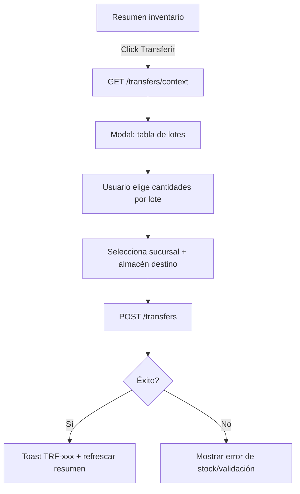
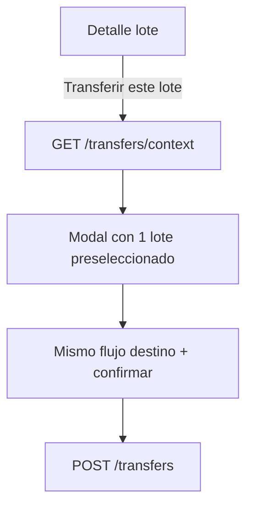

# Transferencias de Inventario — Guía para UI

Documento de referencia para implementar transferencias de stock entre almacenes, con soporte **totalizado** (desde resumen de inventario) y **por lote** (desde detalle de lote).

## Modelo de negocio

### Jerarquía

```
Organización
 └── Sucursal (billing_branch)
      └── Almacén (warehouse) — una sucursal puede tener 1 o muchos almacenes
           └── Lote (inventory batch) — stock físico con trazabilidad
```

### Conceptos clave

| Concepto | Descripción |
|----------|-------------|
| **Vista totalizada** | Stock agrupado por `producto + almacén`. La cantidad mostrada es la **suma** de todos los lotes disponibles en ese almacén. |
| **Transferencia** | Documento `TRF-000001` que mueve cantidad de uno o más lotes origen hacia un almacén destino. |
| **Línea de transferencia** | Cantidad tomada de un lote origen específico → genera un **nuevo lote destino** en el almacén de llegada. |
| **Trazabilidad** | Cada lote destino guarda `transferred_from_batch_id` apuntando al lote origen. La OC de compra original se preserva. |

### Reglas del backend

1. Origen y destino deben ser **almacenes distintos** (pueden ser de la misma o distinta sucursal).
2. Todas las líneas deben ser del **mismo producto y UOM** que el encabezado.
3. Cada lote solo puede aparecer **una vez** en las líneas.
4. La cantidad por línea no puede exceder `available_quantity` del lote.
5. Al confirmar: se descuenta origen, se crea lote nuevo en destino con número `{prefix}-LOTE-{secuencial}`.
6. Permisos: `inventory:read` para consultas, `inventory:write` para crear transferencias.

---

## Endpoints

Base: `/api/tenant/inventory`

| Método | Ruta | Permiso | Uso |
|--------|------|---------|-----|
| `GET` | `/summary` | read | Lista totalizada producto+almacén con desglose de lotes |
| `GET` | `/transfers/context?product_id=&warehouse_id=` | read | Contexto para abrir modal de transferencia |
| `POST` | `/transfers` | write | Crear transferencia |
| `GET` | `/transfers` | read | Historial de transferencias |
| `GET` | `/transfers/:id` | read | Detalle de una transferencia |
| `GET` | `/batches/:id` | read | Detalle de lote (incluye `transfer_history`) |
| `GET` | `/tenant/warehouses` | Warehouse:Read | Almacenes destino |
| `GET` | `/tenant/billing/branches` | — | Sucursales para selector |

---

## Parte 1 — Vista totalizada (inventario resumido)

### Pantalla: Resumen de inventario

**Ruta sugerida:** `/inventario/resumen`

**API:** `GET /api/tenant/inventory/summary?only_available=true`

Cada fila representa un **producto en un almacén**:

```json
{
  "product_id": "uuid",
  "product_name": "Tomate Saladette",
  "product_sku": "TOM-001",
  "warehouse_id": "uuid",
  "warehouse_name": "Almacén Norte",
  "uom_id": "uuid",
  "uom_name": "Kilogramo",
  "total_available_quantity": "150.000",
  "total_batches": 3,
  "batches": [
    {
      "batch_id": "uuid",
      "batch_number": "NORTE-LOTE-000001",
      "available_quantity": "80.000",
      "purchase_order_folio": "OC-000012"
    }
  ]
}
```

### Columnas sugeridas

| Columna | Fuente |
|---------|--------|
| Producto (foto + nombre + SKU) | `product_name`, `product_sku`, `product_photo` |
| Almacén | `warehouse_name` |
| UOM | `uom_name` |
| Stock total | `total_available_quantity` |
| # Lotes | `total_batches` |
| Acciones | Ver lotes · **Transferir** |

### Botón «Transferir»

Abre modal/página de transferencia precargando:
- `product_id`, `uom_id`, `source_warehouse_id` de la fila
- Llamar `GET /transfers/context?product_id=&warehouse_id=` para lotes actualizados

---

## Parte 2 — Modal / pantalla de transferencia (flujo principal)

### Paso 1 — Origen (solo lectura)

Mostrar datos del contexto:

```
Producto:  Tomate Saladette (TOM-001)
UOM:       Kilogramo
Almacén:   Almacén Norte
Sucursal:  {source_warehouse.billing_branch.code} — {city}, {state}
Disponible total: 150.000 kg  (3 lotes)
```

**API:** `GET /api/tenant/inventory/transfers/context?product_id={id}&warehouse_id={id}`

### Paso 2 — Selección de lotes origen

Tabla editable con lotes del contexto:

| ☑ | Lote | OC origen | Etiqueta | Disponible | **A transferir** |
|---|------|-----------|----------|------------|------------------|
| ☑ | NORTE-LOTE-000001 | OC-000012 | TAG-A | 80.000 | `[ 50.000 ]` |
| ☑ | NORTE-LOTE-000002 | OC-000015 | TAG-B | 50.000 | `[ 50.000 ]` |
| ☐ | NORTE-LOTE-000003 | OC-000018 | — | 20.000 | — |

**Validaciones en UI:**
- Solo lotes con checkbox activo envían línea.
- `A transferir` ≤ `Disponible` del lote.
- `A transferir` > 0 cuando el lote está seleccionado.
- **Total a transferir** = suma de cantidades seleccionadas (mostrar en pie del modal).

**Atajo:** botón «Usar todo el disponible» por lote o «Transferir todo» (llena cada lote con su `available_quantity`).

### Paso 3 — Destino (sucursal → almacén)

Selector en cascada:

1. **Sucursal destino** — `GET /api/tenant/billing/branches`
2. **Almacén destino** — filtrar `GET /api/tenant/warehouses` donde `billing_branch_id === sucursalSeleccionada` y `status === 'active'`
3. Excluir el almacén origen de la lista.

```
Sucursal destino:  [ Centro — CDMX        ▼ ]
Almacén destino:   [ Almacén Centro       ▼ ]
```

> Una sucursal puede tener varios almacenes. El usuario **siempre** elige almacén explícitamente, no solo sucursal.

### Paso 4 — Notas y confirmación

```
Notas (opcional): [ Traslado para surtir tienda centro ]
─────────────────────────────────────────────────────
Total a transferir:  100.000 kg  desde 2 lotes
Origen:   Almacén Norte (Sucursal Norte)
Destino:  Almacén Centro (Sucursal Centro)
─────────────────────────────────────────────────────
                    [ Cancelar ]  [ Confirmar transferencia ]
```

### Paso 5 — POST crear transferencia

```http
POST /api/tenant/inventory/transfers
```

```json
{
  "product_id": "uuid-producto",
  "uom_id": "uuid-uom",
  "source_warehouse_id": "uuid-almacen-origen",
  "destination_warehouse_id": "uuid-almacen-destino",
  "notes": "Traslado para surtir tienda centro",
  "lines": [
    { "inventory_batch_id": "uuid-lote-1", "quantity": 50 },
    { "inventory_batch_id": "uuid-lote-2", "quantity": 50 }
  ]
}
```

**Respuesta exitosa (201):**

```json
{
  "id": "uuid",
  "folio": "TRF-000001",
  "total_quantity": "100.000",
  "source_warehouse": {
    "id": "...",
    "name": "Almacén Norte",
    "billing_branch_code": "NORTE"
  },
  "destination_warehouse": {
    "id": "...",
    "name": "Almacén Centro",
    "billing_branch_code": "CENTRO"
  },
  "lines": [
    {
      "source_batch_number": "NORTE-LOTE-000001",
      "destination_batch_number": "CENTRO-LOTE-000003",
      "quantity": "50.000"
    }
  ],
  "created_by_user": { "name": "Juan Pérez", "email": "..." },
  "created_at": "2026-06-25T10:30:00.000Z"
}
```

**Errores comunes (400):**

| Mensaje | Causa |
|---------|-------|
| Stock insuficiente en lote X | Cantidad > disponible (otro usuario consumió stock) |
| El almacén de origen y destino deben ser diferentes | Mismo almacén seleccionado |
| El lote X no pertenece al almacén de origen | Lote de otro almacén en las líneas |

Tras éxito: toast con folio `TRF-000001`, refrescar resumen de inventario.

---

## Parte 3 — Transferencia desde detalle de lote

### Pantalla: Detalle de lote

**Ruta sugerida:** `/inventario/lotes/:id`

**API:** `GET /api/tenant/inventory/batches/:id`

Campos relevantes nuevos:

```json
{
  "batch_number": "NORTE-LOTE-000001",
  "available_quantity": "80.000",
  "transferred_from_batch_id": null,
  "transferred_from_batch_number": null,
  "transfer_history": [
    {
      "transfer_folio": "TRF-000001",
      "direction": "out",
      "quantity": "30.000",
      "related_batch_number": "CENTRO-LOTE-000003",
      "warehouse_name": "Almacén Centro"
    }
  ]
}
```

### Botón «Transferir este lote»

Abre el **mismo modal** del Parte 2 con:
- `product_id`, `uom_id`, `warehouse_id` del lote
- Una sola línea preseleccionada con `available_quantity` como default
- Usuario puede reducir cantidad (transferencia parcial del lote)

Si `available_quantity === 0`, deshabilitar botón.

### Sección historial en detalle

Tabla `transfer_history`:

| Folio | Dirección | Cantidad | Lote relacionado | Almacén | Fecha |
|-------|-----------|----------|------------------|---------|-------|
| TRF-000001 | Salida ↗ | 30.000 | CENTRO-LOTE-000003 | Almacén Centro | 25/06/2026 |

- `direction: out` → este lote fue origen
- `direction: in` → este lote fue creado por transferencia entrante
- Link al folio: `/inventario/transferencias/:transfer_id`

Si `transferred_from_batch_number` existe, mostrar banner:
> *Este lote proviene de la transferencia del lote **NORTE-LOTE-000001**.*

---

## Parte 4 — Historial de transferencias

### Pantalla: Listado

**Ruta sugerida:** `/inventario/transferencias`

**API:** `GET /api/tenant/inventory/transfers`

Filtros disponibles:

| Parámetro | Uso |
|-----------|-----|
| `search` | Folio, nombre o SKU de producto |
| `product_id` | Producto específico |
| `source_warehouse_id` | Almacén origen |
| `destination_warehouse_id` | Almacén destino |
| `source_billing_branch_id` | Sucursal origen |
| `destination_billing_branch_id` | Sucursal destino |
| `created_from` / `created_to` | Rango de fechas |

### Columnas sugeridas

| Folio | Producto | Cantidad | Origen | Destino | Usuario | Fecha |
|-------|----------|----------|--------|---------|---------|-------|
| TRF-000001 | Tomate Saladette | 100.000 kg | Norte / Alm. Norte | Centro / Alm. Centro | Juan Pérez | 25/06/2026 |

### Pantalla detalle

**API:** `GET /api/tenant/inventory/transfers/:id`

Mostrar encabezado + tabla de líneas:

| Lote origen | Cantidad | Lote destino creado |
|-------------|----------|---------------------|
| NORTE-LOTE-000001 | 50.000 | CENTRO-LOTE-000003 |
| NORTE-LOTE-000002 | 50.000 | CENTRO-LOTE-000004 |

Links a detalle de cada lote.

---

## Diagrama de flujo (totalizado)



## Diagrama de flujo (desde lote)



---

## Permisos y menú

| Acción UI | Permiso requerido |
|-----------|-------------------|
| Ver resumen / lotes / transferencias | `inventory:read` |
| Crear transferencia | `inventory:write` |

Sugerencia de menú:
- **Inventario** → Resumen (totalizado)
- **Inventario** → Lotes
- **Inventario** → Transferencias (historial)

---

## Notas de implementación UI

1. **Refrescar contexto** antes de confirmar si el modal lleva abierto mucho tiempo (evita error de stock insuficiente).
2. **Decimales:** mostrar 3 decimales (`150.000`) consistente con el API.
3. **Sucursal sin almacenes:** si al elegir sucursal no hay almacenes activos, mostrar mensaje y bloquear confirmar.
4. **Mismo almacén:** validar en cliente antes de POST.
5. El stock totalizado en resumen **baja automáticamente** tras transferencia exitosa; no hace falta cálculo local persistente.
6. Para almacenes destino de otra sucursal, no se requiere permiso especial adicional — solo `inventory:write`.
