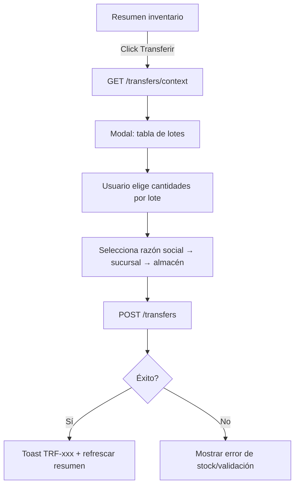
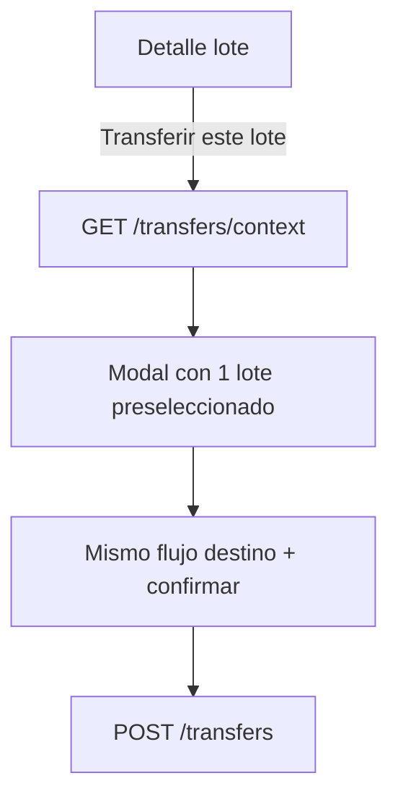

# Transferencias de Inventario — Guía para UI

Documento de referencia para implementar transferencias de stock entre almacenes, con soporte **totalizado** (desde resumen de inventario) y **por lote** (desde detalle de lote).

> **UI:** el modal actual (sucursal + almacén planos) se **reemplaza**. Destino es cascada razón social → sucursal → almacén. Listado y detalle muestran los 3 niveles en origen y destino.

## Modelo de negocio

### Jerarquía

```
Organización
 └── Razón social (fiscal_configuration)
      └── Sucursal (billing_branch)
           └── Almacén (warehouse) — una sucursal puede tener 1 o muchos almacenes
                └── Lote (inventory batch) — stock físico con trazabilidad
```

### Conceptos clave

| Concepto | Descripción |
|----------|-------------|
| **Vista totalizada** | Stock agrupado por `producto + almacén`. La cantidad mostrada es la **suma** de todos los lotes disponibles en ese almacén. |
| **Transferencia** | Documento `TRF-000001` que mueve cantidad de uno o más lotes origen hacia un almacén destino. |
| **Línea de transferencia** | Cantidad tomada de un lote origen específico → genera un **nuevo lote destino** en el almacén de llegada. |
| **Trazabilidad** | Cada lote destino guarda `transferred_from_batch_id` apuntando al lote origen. La OC de compra original se preserva. |

### Reglas del backend

1. Origen y destino deben ser **almacenes distintos** (pueden ser de la misma o distinta sucursal).
2. Todas las líneas deben ser del **mismo producto y UOM** que el encabezado.
3. Cada lote solo puede aparecer **una vez** en las líneas.
4. La cantidad por línea no puede exceder `available_quantity` del lote.
5. Al confirmar: se descuenta origen, se crea lote nuevo en destino con número `{razon}-{sucursal}-{almacen}-{5 dígitos}` (ej. `MZN-SBA-BDGA-00011`). El almacén destino debe tener prefijos de razón, sucursal y almacén.
6. Permisos: `Inventory:Read` para consultar; `Inventory:Transfer` para crear (separado de `Write`).

---

## Endpoints

Base: `/api/tenant/inventory`

| Método | Ruta | Permiso | Uso |
|--------|------|---------|-----|
| `GET` | `/summary` | read | Lista totalizada producto+almacén con desglose de lotes |
| `GET` | `/transfers/context?product_id=&warehouse_id=` | Transfer | Contexto: origen + lotes + **árbol destino** |
| `POST` | `/transfers` | Transfer | Crear transferencia |
| `GET` | `/transfers` | Read | Historial de transferencias |
| `GET` | `/transfers/:id` | Read | Detalle de una transferencia |
| `GET` | `/transfers/:id/pdf` | Read | Descargar PDF comprobante |
| `GET` | `/batches/:id` | read | Detalle de lote (incluye `transfer_history`) |

---

## Parte 1 — Vista totalizada (inventario resumido)

### Pantalla: Resumen de inventario

**Ruta sugerida:** `/inventario/resumen`

**API:** `GET /api/tenant/inventory/summary?only_available=true`

Cada fila representa un **producto en un almacén**:

```json
{
  "product_id": "uuid",
  "product_name": "Tomate Saladette",
  "product_sku": "TOM-001",
  "warehouse_id": "uuid",
  "warehouse_name": "Almacén Norte",
  "uom_id": "uuid",
  "uom_name": "Kilogramo",
  "total_available_quantity": "150.000",
  "total_batches": 3,
  "batches": [
    {
      "batch_id": "uuid",
      "batch_number": "NORTE-LOTE-000001",
      "available_quantity": "80.000",
      "purchase_order_folio": "OC-000012"
    }
  ]
}
```

### Columnas sugeridas

| Columna | Fuente |
|---------|--------|
| Producto (foto + nombre + SKU) | `product_name`, `product_sku`, `product_photo` |
| Almacén | `warehouse_name` |
| UOM | `uom_name` |
| Stock total | `total_available_quantity` |
| # Lotes | `total_batches` |
| Acciones | Ver lotes · **Transferir** |

### Botón «Transferir»

Abre modal/página de transferencia precargando:
- `product_id`, `uom_id`, `source_warehouse_id` de la fila
- Llamar `GET /transfers/context?product_id=&warehouse_id=` para lotes actualizados

---

## Parte 2 — Modal / pantalla de transferencia (flujo principal)

### Paso 1 — Origen (solo lectura)

Tarjeta de origen **completa** (no solo sucursal + almacén):

```
Producto:  SELLADOR ALTOS SOLIDOS LTO. NS44/300.30
SKU / UOM: NS4430030 · Pieza

RAZÓN SOCIAL   MADERERIA ZONA NORTE S.A. DE C.V.   RFC MZN...
SUCURSAL       CENTRO — Tijuana, Baja California
ALMACÉN        Bodega
DISPONIBLE     9 Pieza · 1 lote
```

Fuente: `source_warehouse` del context.

```
source_warehouse.billing_branch.fiscal_configuration.razon_social
source_warehouse.billing_branch.fiscal_configuration.rfc
source_warehouse.billing_branch.code
source_warehouse.billing_branch.city + state
source_warehouse.name
```

**API:** `GET /api/tenant/inventory/transfers/context?product_id={id}&warehouse_id={id}`

`destinations` llega en el mismo response (árbol razón → sucursal → almacén, sin el almacén origen). No hagas un segundo fetch para el modal.

### Paso 2 — Selección de lotes origen

Tabla editable con lotes del contexto:

| ☑ | Lote | OC origen | Etiqueta | Disponible | **A transferir** |
|---|------|-----------|----------|------------|------------------|
| ☑ | NORTE-LOTE-000001 | OC-000012 | TAG-A | 80.000 | `[ 50.000 ]` |
| ☑ | NORTE-LOTE-000002 | OC-000015 | TAG-B | 50.000 | `[ 50.000 ]` |
| ☐ | NORTE-LOTE-000003 | OC-000018 | — | 20.000 | — |

**Validaciones en UI:**
- Solo lotes con checkbox activo envían línea.
- `A transferir` ≤ `Disponible` del lote.
- `A transferir` > 0 cuando el lote está seleccionado.
- **Total a transferir** = suma de cantidades seleccionadas (mostrar en pie del modal).

**Atajo:** botón «Usar todo el disponible» por lote o «Transferir todo» (llena cada lote con su `available_quantity`).

### Paso 3 — Destino (razón social → sucursal → almacén)

**No uses** `GET /warehouses` ni `GET /billing/branches` planos. El context trae `destinations[]` ya filtrado (activos, sin el almacén origen).

Cascada **obligatoria**, un paso habilita el siguiente:

| Orden | Control | Fuente | Label |
|-------|---------|--------|-------|
| 1 | Razón social destino | `destinations[]` | `razon_social` · `rfc` |
| 2 | Sucursal destino | `fiscal.branches` | `name` — city/state si lo tienes del catálogo; hoy `name` = código de sucursal |
| 3 | Almacén destino | `branch.warehouses` | `name` |

Reglas UI:
- Sucursal **disabled** hasta elegir razón social. Al cambiar razón, reset sucursal + almacén.
- Almacén **disabled** hasta elegir sucursal. Al cambiar sucursal, reset almacén.
- Si una razón/sucursal queda sin almacenes, no la muestres (el API ya las omite).
- Confirmar disabled hasta tener `destination_warehouse_id`.

```
Razón social:  [ MADERERIA ZONA NORTE S.A. DE C.V.     ▼ ]
Sucursal:      [ CENTRO                                  ▼ ]
Almacén:       [ Mostrador                               ▼ ]
```

El POST **sigue** enviando solo `destination_warehouse_id`. Razón y sucursal son UX.

### Paso 3b — Rediseño del modal (obligatorio)

El modal actual (dos dropdowns + tabla gris) **no se itera: se reemplaza**.

Layout sugerido, full-height ~720px:

```
┌─────────────────────────────────────────────────────────────┐
│  Transferir inventario                          [×]         │
│  3 pasos: lotes → destino → confirmar                       │
├───────────────┬─────────────────────────────────────────────┤
│ ORIGEN        │  PASO ACTIVO                                │
│ (sticky)      │                                             │
│ Razón social  │  Stepper  [1 Lotes] [2 Destino] [3 Listo]   │
│ Sucursal      │                                             │
│ Almacén       │  Contenido del paso                         │
│ Disponible    │                                             │
│               │                                             │
│ TOTAL 9 Pza   │                                             │
│ 1 lote        │                                             │
├───────────────┴─────────────────────────────────────────────┤
│  Bodega  →  {razón} / {sucursal} / {almacén}                │
│                     [Cancelar]  [Continuar / Confirmar]     │
└─────────────────────────────────────────────────────────────┘
```

- **Stepper interactivo:** no un form plano. Avanzar con Continuar; Destino se desbloquea cuando hay cantidad > 0.
- **Origen vs destino:** dos columnas visuales, no labels sueltos. Destino se va llenando en vivo (razón → sucursal → almacén) con chevrons.
- **Lotes:** filas seleccionables grandes, input de cantidad prominente, `Max` y `Transferir todo`.
- **Pie de ruta:** `Bodega → elige destino` se convierte en `Bodega → CENTRO / Mostrador` al completar la cascada; si cruzan razón social, mostrarlo explícito: `MZN / CENTRO / Bodega  →  OTRA RAZÓN / OTAY / Piso`.
- Misma paleta Pollux (púrpura), más aire, tipografía de jerarquía (razón social 12px muted, sucursal 14px, almacén 16px bold).

### Paso 4 — Notas y confirmación

```
Notas (opcional): [ Traslado para surtir tienda centro ]
─────────────────────────────────────────────────────
Total:  9.000 Pieza  ·  1 lote
Origen:   MADERERIA ZONA NORTE  ·  CENTRO  ·  Bodega
Destino:  MADERERIA ZONA NORTE  ·  OTAY    ·  Mostrador
─────────────────────────────────────────────────────
                    [ Atrás ]  [ Confirmar transferencia ]
```

### Paso 5 — POST crear transferencia

```http
POST /api/tenant/inventory/transfers
```

```json
{
  "product_id": "uuid-producto",
  "uom_id": "uuid-uom",
  "source_warehouse_id": "uuid-almacen-origen",
  "destination_warehouse_id": "uuid-almacen-destino",
  "notes": "Traslado para surtir tienda centro",
  "lines": [
    { "inventory_batch_id": "uuid-lote-1", "quantity": 50 },
    { "inventory_batch_id": "uuid-lote-2", "quantity": 50 }
  ]
}
```

**Respuesta exitosa (201):**

```json
{
  "id": "uuid",
  "folio": "TRF-000001",
  "total_quantity": "100.000",
  "source_warehouse": {
    "id": "...",
    "name": "Bodega",
    "code": "BDG",
    "billing_branch_id": "...",
    "billing_branch_code": "CENTRO",
    "billing_branch_city": "Tijuana",
    "billing_branch_state": "Baja California",
    "fiscal_configuration_id": "...",
    "fiscal_razon_social": "MADERERIA ZONA NORTE S.A. DE C.V.",
    "fiscal_rfc": "MZN010101XXX"
  },
  "destination_warehouse": {
    "id": "...",
    "name": "Mostrador",
    "billing_branch_code": "OTAY",
    "fiscal_razon_social": "MADERERIA ZONA NORTE S.A. DE C.V.",
    "fiscal_rfc": "MZN010101XXX"
  },
  "lines": [
    {
      "source_batch_number": "NORTE-LOTE-000001",
      "destination_batch_number": "CENTRO-LOTE-000003",
      "quantity": "50.000"
    }
  ],
  "created_by_user": { "name": "Juan Pérez", "email": "..." },
  "created_at": "2026-06-25T10:30:00.000Z"
}
```

**Errores comunes (400):**

| Mensaje | Causa |
|---------|-------|
| Stock insuficiente en lote X | Cantidad > disponible (otro usuario consumió stock) |
| El almacén de origen y destino deben ser diferentes | Mismo almacén seleccionado |
| El lote X no pertenece al almacén de origen | Lote de otro almacén en las líneas |

Tras éxito: toast con folio `TRF-000001`, refrescar resumen de inventario.

---

## Parte 3 — Transferencia desde detalle de lote

### Pantalla: Detalle de lote

**Ruta sugerida:** `/inventario/lotes/:id`

**API:** `GET /api/tenant/inventory/batches/:id`

Campos relevantes nuevos:

```json
{
  "batch_number": "NORTE-LOTE-000001",
  "available_quantity": "80.000",
  "transferred_from_batch_id": null,
  "transferred_from_batch_number": null,
  "transfer_history": [
    {
      "transfer_folio": "TRF-000001",
      "direction": "out",
      "quantity": "30.000",
      "related_batch_number": "CENTRO-LOTE-000003",
      "warehouse_name": "Almacén Centro"
    }
  ]
}
```

### Botón «Transferir este lote»

Abre el **mismo modal** del Parte 2 con:
- `product_id`, `uom_id`, `warehouse_id` del lote
- Una sola línea preseleccionada con `available_quantity` como default
- Usuario puede reducir cantidad (transferencia parcial del lote)

Si `available_quantity === 0`, deshabilitar botón.

### Sección historial en detalle

Tabla `transfer_history`:

| Folio | Dirección | Cantidad | Lote relacionado | Almacén | Fecha |
|-------|-----------|----------|------------------|---------|-------|
| TRF-000001 | Salida ↗ | 30.000 | CENTRO-LOTE-000003 | Almacén Centro | 25/06/2026 |

- `direction: out` → este lote fue origen
- `direction: in` → este lote fue creado por transferencia entrante
- Link al folio: `/inventario/transferencias/:transfer_id`

Si `transferred_from_batch_number` existe, mostrar banner:
> *Este lote proviene de la transferencia del lote **NORTE-LOTE-000001**.*

---

## Parte 4 — Historial de transferencias

### Pantalla: Listado

**Ruta sugerida:** `/inventario/transferencias`

**API:** `GET /api/tenant/inventory/transfers`

Cada fila **no** es `Norte / Alm. Norte`. Es una ruta de 3 niveles por lado.

Filtros (cascada origen y destino, mismos que inventario):

| Parámetro | Uso |
|-----------|-----|
| `search` | Folio, nombre o SKU de producto |
| `product_id` | Producto específico |
| `source_fiscal_configuration_id` | Razón social origen |
| `source_billing_branch_id` | Sucursal origen |
| `source_warehouse_id` | Almacén origen |
| `destination_fiscal_configuration_id` | Razón social destino |
| `destination_billing_branch_id` | Sucursal destino |
| `destination_warehouse_id` | Almacén destino |
| `created_from` / `created_to` | Rango de fechas |

Catálogo de filtros: `GET /api/tenant/inventory/locations` (igual que el listado de inventario).

### Columnas

| Folio | Producto | Cantidad | Origen | Destino | Usuario | Fecha |
|-------|----------|----------|--------|---------|---------|-------|

**Origen / Destino** — celda de 3 líneas, no un string plano:

```
MADERERIA ZONA NORTE          ← fiscal_razon_social  (12px muted, truncar)
CENTRO — Tijuana              ← billing_branch_code + city
Bodega                        ← name  (semibold)
```

Si origen y destino son la **misma razón social**, no repetir el nombre enorme: mostrar sucursal + almacén y un chip `Misma razón`. Si cruzan razón, ambas razones en bold y un chip `Cambio de razón social`.

Ancho: origen y destino lado a lado con un `→` entre columnas. En mobile, apilar Destino debajo de Origen.

### Pantalla detalle

**API:** `GET /api/tenant/inventory/transfers/:id`

Encabezado = dos tarjetas espejo (misma info que el modal):

```
ORIGEN                              DESTINO
MADERERIA ZONA NORTE                MADERERIA ZONA NORTE
RFC MZN...                          RFC MZN...
CENTRO — Tijuana, B.C.              OTAY — Tijuana, B.C.
Bodega                              Mostrador
```

Luego producto, total, usuario, notas.

Tabla de líneas:

| Lote origen | Cantidad | Lote destino creado |
|-------------|---------|---------------------|
| MZN-CTR-BDG-01489 | 9.000 | MZN-OTY-MOS-00012 |

Links a detalle de cada lote.

### Descargar PDF

**API:** `GET /api/tenant/inventory/transfers/:id/pdf`

- Permiso: `Inventory:Read`
- Response: `application/pdf` (attachment)
- Filename: `transferencia-TRF-000001.pdf`

Contenido del PDF:
- Folio + estado + fecha/hora
- Quién transfirió (nombre + correo)
- Ruta origen → destino (nombre de almacén, razón social, RFC, sucursal, ciudad; nunca UUID)
- Producto (nombre, SKU, UOM, cantidad total)
- Tabla de líneas (lote origen → cantidad → lote destino)
- Notas (si hay)

**UI:** botón **Descargar PDF** en detalle de transferencia y en historial (acción por fila). Abrir blob / `window.open` con el token Authorization.

```ts
async downloadTransferPdf(transferId: string, folio: string) {
  const blob = await api.getBlob(`/tenant/inventory/transfers/${transferId}/pdf`);
  const url = URL.createObjectURL(blob);
  const a = document.createElement('a');
  a.href = url;
  a.download = `transferencia-${folio}.pdf`;
  a.click();
  URL.revokeObjectURL(url);
}
```

---

## Diagrama de flujo (totalizado)



## Diagrama de flujo (desde lote)



---

## Permisos y menú

| Acción UI | Permiso requerido |
|-----------|-------------------|
| Ver menú Inventario | `Inventory:ViewMenu` |
| Ver resumen / lotes / historial / PDF | `Inventory:Read` |
| **Crear transferencia** (botón + modal + POST) | `Inventory:Transfer` |
| Editar otros datos de inventario (si aplica) | `Inventory:Write` |

> **Importante:** crear transferencia **ya no usa** `Write`. Es un permiso separado: `Inventory:Transfer`.
> Si el usuario ve Inventario pero no el botón, falta `Transfer` en su rol (no alcanza con Read).

Tras asignar permisos: **cerrar sesión / refresh token** (`permissions_version`).

Sugerencia de menú:
- **Inventario** → Resumen (totalizado)
- **Inventario** → Lotes
- **Inventario** → Transferencias (historial)

---

## Notas de implementación UI

1. **Refrescar contexto** antes de confirmar si el modal lleva abierto mucho tiempo (evita error de stock insuficiente).
2. **Decimales:** mostrar 3 decimales (`150.000`) consistente con el API.
3. **Sucursal/almacén vacíos:** el árbol `destinations` ya omite nodos sin almacén activo. No pidas warehouses extra.
4. **Mismo almacén:** el origen no viene en `destinations`. Aun así valida en cliente antes de POST.
5. El stock totalizado en resumen **baja automáticamente** tras transferencia exitosa; no hace falta cálculo local persistente.
6. Para destino de otra razón social o sucursal no se requiere permiso extra — solo `Inventory:Transfer`.
7. **No** uses `GET /tenant/warehouses` ni `GET /tenant/billing/branches` en este flujo. Todo sale de `/transfers/context` (modal) y `/inventory/locations` (filtros del historial).
