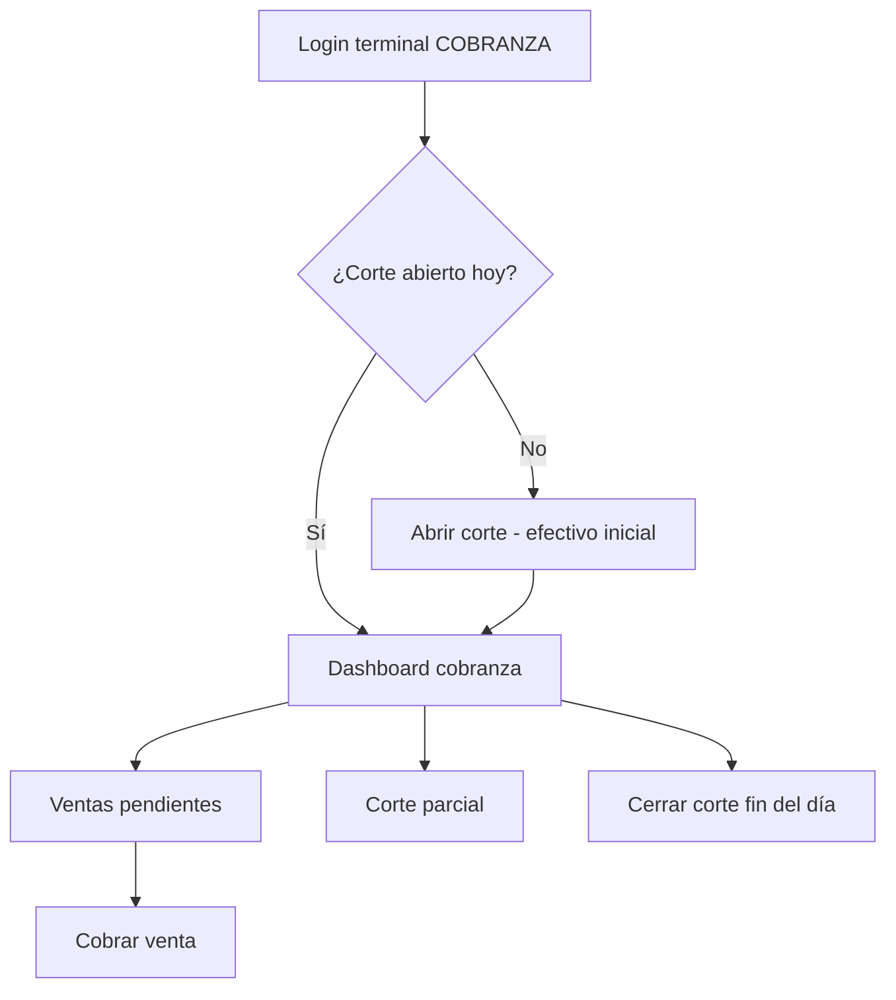
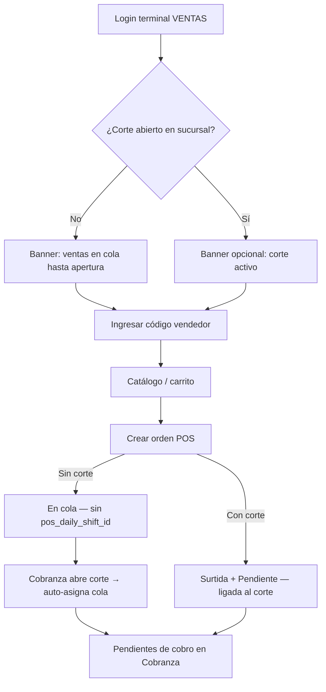
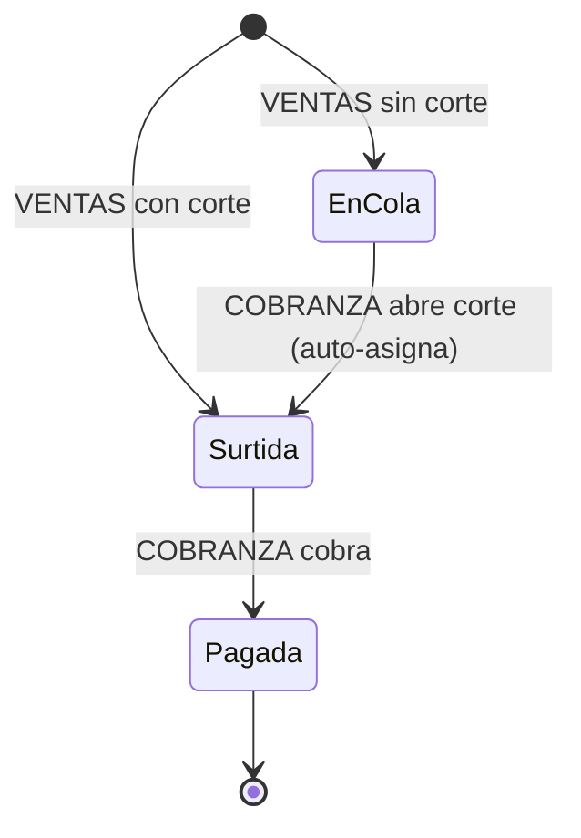
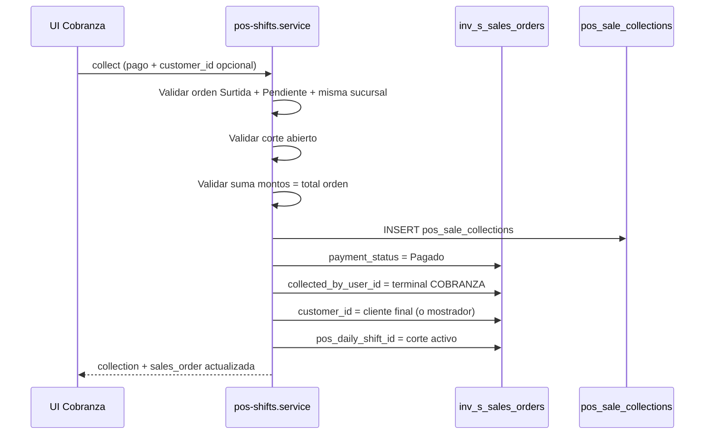

# Flujo POS — Guía para UI

Documento de referencia del nuevo modelo POS. Reemplaza **Equipos** (`pos_configurations`) y **Sesiones** (`pos_sessions`).

## Resumen del modelo

| Concepto anterior | Concepto nuevo |
|-------------------|----------------|
| Equipo POS | Usuario con `is_pos_user: true` |
| Sesión POS | **Corte global** (`pos_daily_shifts`) — varios por sucursal por día, **uno abierto** a la vez |
| Usuario en sesión | Vendedor identificado por **código numérico** (`pos_user_code`) |
| Retiro de efectivo | **Corte parcial** con desglose de billetes MXN/USD |
| Ventas sin corte abierto | Órdenes en **cola** (`En cola`, sin `pos_daily_shift_id`) hasta que Cobranza abra el día |

### Tipos de terminal POS (`pos_user_type`)

| Tipo | Rol | Quién |
|------|-----|--------|
| `VENTAS` | Captura pedidos. No cobra ni maneja corte. | Cualquier usuario POS |
| `COBRANZA` | Abre/cierra corte, cortes parciales, cobra ventas pendientes. | Cualquier usuario POS |
| `AMBOS` | Ventas **y** cobranza. Ve ambas opciones en el menú. | **Solo gerentes** (`is_manager: true`) |

Un POS normal es **Ventas o Cobranza**, nunca los dos. Si el usuario es gerente y POS, puede ser `AMBOS`.

### Tipos de usuario en el sistema

| Usuario | `is_pos_user` | `pos_user_type` | `pos_user_code` | Sucursal |
|---------|---------------|-----------------|-----------------|----------|
| Terminal Ventas | `true` | `VENTAS` | Opcional (si vende) | Obligatoria |
| Terminal Cobranza | `true` | `COBRANZA` | Opcional | Obligatoria |
| Gerente POS | `true` | `AMBOS` | Recomendado (para vender) | Obligatoria |
| Vendedor | `false` | `null` | Opcional (único por organización) | Opcional |

### División Ventas vs Cobranza (regla de oro)

| Acción | Terminal VENTAS | Terminal COBRANZA |
|--------|-----------------|-------------------|
| Catálogo + carrito | Sí | No (solo cobra pendientes) |
| Seleccionar cliente | **No** | **Sí** (al cobrar) |
| Método de pago / efectivo / cambio | **No** | **Sí** |
| Crear pre-orden (`POST sales-orders`) | Sí | Solo casos excepcionales |
| Cobrar (`POST pos/sales/:id/collect`) | **No** | Sí |

La orden POS es una **pre-orden**: productos + vendedor + total. Cliente y pago se resuelven en cobranza.

---

## Parte 1 — Configuración en backoffice (Gestión de Usuarios)

### Modal usuario — 3 tabs

#### Tab: Información general
Campos habituales (nombre, email, contraseña, etc.). Sin cambios POS aquí.

#### Tab: POS

**Check:** `Usuario de tipo POS` → `is_pos_user`

**Código POS** (`pos_user_code`, ej. `33456`): **siempre visible**, también si el check POS está marcado. Es el número que se teclea en la pantalla de ventas. Un gerente que vende necesita el suyo.

Si **desmarcado** (vendedor normal):
- Ocultar selector Ventas/Cobranza.

Si **marcado** (terminal):
- Si **no** es gerente: selector **obligatorio** Ventas **o** Cobranza → `pos_user_type` (`VENTAS` / `COBRANZA`). No puede marcar ambos.
- Si **sí** es gerente (`is_manager`): puede elegir **Ventas y cobranza** → `pos_user_type: "AMBOS"`. En el menú POS verá las dos apps.
- Texto de ayuda:
  > *Las terminales POS requieren sucursal asignada. **Ventas** solo captura pedidos; **Cobranza** maneja el corte del día y el cobro. Un **gerente** puede operar ambos. El código es el que se teclea en POS al vender.*

**Bloqueo en edición:** si el usuario es `COBRANZA` y tiene un **corte global abierto**, deshabilitar cambio de tipo POS, check POS y sucursal. El API responde 400 si se intenta cambiar.

#### Tab: Sucursales asignadas

- **Una sola sucursal** (radio/select), no multi-select.
- Opción “Sin restricción / Todas” → `billing_branch_id: null` (solo usuarios **no POS**).
- Si `is_pos_user === true` → sucursal **obligatoria**.
- Si `is_pos_user === true` y `pos_user_type === COBRANZA` → sucursal obligatoria (misma regla).

**API usuarios:**
- `POST /api/tenant/users`
- `PUT /api/tenant/users/:userId`
- `GET /api/tenant/users` / `GET /api/tenant/users/:userId`

**Campos relevantes en respuesta:**
```json
{
  "is_pos_user": true,
  "pos_user_type": "COBRANZA",
  "pos_user_code": 33456,
  "billing_branch_id": "uuid",
  "billing_branch": { "id", "code", "fiscal_configuration": { "razon_social", "rfc" } },
  "has_all_branches_access": false
}
```

**Badges en lista de usuarios:**
- `POS Ventas` / `POS Cobranza`
- Código del vendedor si aplica
- Nombre de sucursal

### Pantalla Configuración POS (menú Punto de Venta)

**Eliminar:**
- Tab Equipos y botón “Nuevo Equipo”
- Tab Sesiones
- Cualquier llamada a `/api/tenant/pos-configurations` o `/api/tenant/pos-sessions`

**Reemplazar por tab Cortes:**
- `GET /api/tenant/pos/daily-shifts?terminal_user_id=&billing_branch_id=&shift_date=&status=`
- Detalle: `GET /api/tenant/pos/daily-shift/:id`
- Columnas: fecha, terminal cobranza, sucursal, estado, ventas totales, # parciales, efectivo inicial

**Sucursales para dropdowns:**
- `GET /api/tenant/billing/branches`

---

## Parte 2 — Autenticación

Cada **terminal** es un usuario normal del ERP con login estándar (JWT).

```
POST /api/auth/login  →  token de la terminal (VENTAS o COBRANZA)
```

El **vendedor** no hace login. Solo ingresa su código en la pantalla POS; el token sigue siendo el de la terminal.

### Respuesta de login (campos POS)

Pollux **no** debe llamar `GET /api/tenant/users/:id` (requiere `User:Read`). Usar el objeto `user` del login:

```json
{
  "access_token": "eyJhbGc...",
  "user": {
    "id": "uuid",
    "email": "cima_cobranza_t1@zonanorte.com",
    "tenant_id": "uuid",
    "status": "active",
    "roles": ["Punto de Venta"],
    "permissions_flat": ["pos:ViewMenu", "pos:read"],
    "permissions_version": 1,
    "is_pos_user": true,
    "pos_user_type": "COBRANZA",
    "pos_can_sell": false,
    "pos_can_collect": true,
    "is_manager": false,
    "billing_branch_id": "uuid-sucursal",
    "fiscal_configuration_id": "uuid-razon-social"
  }
}
```

| Campo | Uso en Pollux |
|-------|----------------|
| `is_pos_user` | `false` → no es terminal POS (no entrar a app POS o mostrar error) |
| `pos_user_type` | `VENTAS` / `COBRANZA` / `AMBOS` |
| `pos_can_sell` | `true` → mostrar menú / app **Ventas** |
| `pos_can_collect` | `true` → mostrar menú / app **Cobranza** |
| `is_manager` | Si es gerente. `AMBOS` solo es válido con esto en `true` |
| `billing_branch_id` | Sucursal de la terminal (obligatorio si `is_pos_user`) |
| `fiscal_configuration_id` | Razón social de esa sucursal. Usar en `POST sales-orders`. **No** sacarla de `GET /warehouses/:id` ni de Ajustes. |

Si `pos_can_sell && pos_can_collect` (gerente `AMBOS`), mostrar **ambas** opciones en el menú. No rutees a una sola app.

```
if (user.pos_can_collect) → item menú Cobranza / /pos/cobranza
if (user.pos_can_sell)    → item menú Ventas   / /pos/ventas
```

Los mismos campos POS vienen en `POST /api/auth/refresh`.

### Routing UI tras login (Pollux)

Guardar `user` en sesión (localStorage / state). **No** pedir código de vendedor hasta saber el tipo.

```
if (!user.is_pos_user) → error o redirigir al ERP
if (user.pos_can_collect && user.pos_can_sell) → menú con Ventas y Cobranza (no forzar una sola ruta)
if (user.pos_can_collect) → /pos/cobranza
if (user.pos_can_sell)    → /pos/ventas
```

| Ruta | Quién | Primera pantalla |
|------|-------|------------------|
| `/pos/cobranza` | `COBRANZA` o `AMBOS` | `GET pos/daily-shift/current` → abrir corte o dashboard pendientes |
| `/pos/ventas` | `VENTAS` o `AMBOS` | Código vendedor → catálogo |

`POST /api/auth/refresh` debe actualizar los mismos campos en sesión si cambian permisos o datos POS del usuario.

---

## Parte 3 — Flujo terminal COBRANZA



### Paso 1 — Login
Usuario: `POS Cobranza CIMA` (ejemplo). Token en todas las peticiones.

### Paso 2 — Verificar corte del día
```
GET /api/tenant/pos/daily-shift/current
```

Respuesta si hay corte:
```json
{
  "daily_shift": {
    "id": "uuid",
    "shift_date": "2026-06-25",
    "status": "open",
    "opening_cash_mxn": 1500,
    "opening_cash_usd": 0,
    "terminal_user": { ... },
    "billing_branch": { ... },
    "sales_summary": { "total_mxn": 8300, "sales_count": 10 },
    "partial_shifts": [ ... ],
    "totals": { "partial_shifts_count": 1, "removed_total_mxn": 5000, "sales_total_mxn": 8300 }
  }
}
```

Si `daily_shift: null` → mostrar pantalla **“Abrir corte del día”**.

### Paso 3 — Abrir corte global (solo COBRANZA)
```
POST /api/tenant/pos/daily-shift/open
```
```json
{
  "opening_cash_mxn": 1500,
  "opening_cash_usd": 0,
  "notes": "Apertura turno matutino"
}
```

Reglas:
- Varios cortes **completos** (abierto → cerrado) por **sucursal** el mismo día.
- Solo puede haber **un corte abierto** a la vez por sucursal (aunque sea de un día anterior).
- Tras cerrar un corte, se puede abrir otro el mismo día con nuevo efectivo inicial.
- Si quedó un corte abierto de otro día, `GET daily-shift/current` lo devuelve; la UI debe permitir cerrarlo antes de abrir uno nuevo.

**Al abrir el corte (automático):** el backend asigna al corte todas las órdenes POS de la **misma sucursal** que estén en cola (`general_status: En cola`, `pos_daily_shift_id: null`, del día). Pasan a `Surtida` + `Pendiente` con `pos_daily_shift_id` del corte nuevo.

Respuesta sugerida:
```json
{
  "message": "Corte global abierto correctamente",
  "daily_shift": { "id", "shift_date", "status": "open", ... },
  "queued_sales_assigned": 4
}
```

**UI Cobranza tras abrir:**
- Toast o banner: *"Corte abierto. Se asignaron 4 órdenes de cola."*
- Si `queued_sales_assigned > 0`: *"Tienes 4 órdenes por cobrar"* en el dashboard (badge en la sección de pendientes).
- Redirigir o destacar la lista `pending-sales` para cobrar de inmediato.

Si no había cola (`queued_sales_assigned: 0`), solo confirmar apertura y mostrar dashboard normal.

### Paso 4 — Dashboard cobranza (pantallas principales)

| Sección | Endpoint |
|---------|----------|
| Resumen del corte | `GET /api/tenant/pos/daily-shift/current` |
| Ventas por cobrar | `GET /api/tenant/pos/pending-sales` |
| **Ventas cobradas** | `GET /api/tenant/pos/collected-sales` |
| Inventario sucursal | `GET /api/tenant/inventory/pos/summary` |

### Paso 5 — Lista de ventas pendientes
```
GET /api/tenant/pos/pending-sales
```

Devuelve órdenes con:
- `general_status: Surtida`
- `payment_status: Pendiente`
- `sales_order_type: POS`
- **`pos_daily_shift_id` = corte abierto** (misma fuente que `sales_summary.total_mxn` del dashboard)

Si hay corte abierto, no filtra por almacén: las órdenes ligadas al corte aparecen aunque el `warehouse_id` venga mal del frontend.

```json
{
  "pending_sales": [
    {
      "id": "uuid",
      "folio": "OV-000123",
      "total": 830.50,
      "subtotal": 715.00,
      "created_at": "...",
      "notes": null,
      "customer": {
        "id": 1,
        "name": "Público en General",
        "is_walk_in": true
      },
      "seller_user": { "id", "first_name", "last_name", "pos_user_code": 33456 },
      "terminal_user": { "id", "first_name", "last_name", "pos_user_type": "VENTAS" }
    }
  ]
}
```

### Paso 6 — Cobrar venta (solo COBRANZA)

**Ventas NO captura pago ni cliente final** (salvo mostrador por defecto). Todo el cobro ocurre aquí.

```
POST /api/tenant/pos/sales/:salesOrderId/collect
```

#### Ejemplo — efectivo MXN
```json
{
  "payment_method": "cash",
  "amount_cash_mxn": 830.50,
  "received_cash_mxn": 1000,
  "customer_id": 42
}
```

#### Ejemplo — efectivo USD + tipo de cambio
```json
{
  "payment_method": "cash",
  "amount_cash_usd": 50,
  "usd_exchange_rate": 17.25,
  "received_cash_usd": 50
}
```

#### Ejemplo — transferencia
```json
{
  "payment_method": "transfer",
  "amount_transfer_mxn": 830.50,
  "transfer_reference": "SPEI-123456",
  "customer_id": 42
}
```

#### Ejemplo — tarjeta
```json
{
  "payment_method": "card",
  "amount_card_mxn": 830.50,
  "card_reference": "4242"
}
```

#### Ejemplo — mixto (efectivo + transferencia)
```json
{
  "payment_method": "mixed",
  "amount_cash_mxn": 500,
  "received_cash_mxn": 500,
  "amount_transfer_mxn": 330.50,
  "transfer_reference": "SPEI-789",
  "customer_id": 42
}
```

| Campo | Regla |
|-------|--------|
| `payment_method` | `cash` \| `card` \| `transfer` \| `mixed` |
| `customer_id` | Opcional. Si se omite, se mantiene el de la orden (mostrador si Ventas no envió cliente) |
| Montos (`amount_*`) | La suma en MXN debe igualar el `total` de la orden |
| `usd_exchange_rate` | Obligatorio si `amount_cash_usd` > 0 |
| `transfer_reference` | Obligatorio si `amount_transfer_mxn` > 0 |
| `received_cash_*` | Para calcular cambio (`change_cash_*` en respuesta) |

**El backend:**
1. Valida corte abierto en la sucursal.
2. Crea registro en `pos_sale_collections` (auditoría de pago).
3. Marca orden `payment_status: Pagado`, asigna `collected_by_user_id`, `pos_daily_shift_id` y `customer_id` final.
4. Genera y guarda ticket térmico ESC/POS como documento de la orden (**tipo 9 — TICKET / RECIBO**).

**Respuesta:**
```json
{
  "message": "Venta cobrada correctamente",
  "collection": {
    "payment_method": "cash",
    "amount_cash_mxn": 830.50,
    "change_cash_mxn": 169.50,
    "order_total_mxn": 830.50
  },
  "receipt": {
    "document_id": "uuid",
    "file_name": "TICKET_RECIBO-OV-000123.escpos",
    "mime_type": "application/octet-stream",
    "download_url": "https://...",
    "escpos_base64": "...",
    "plain_text": "MADERERIA...",
    "printer_profile": "bixolon-srp-330iii-escpos-80mm"
  },
  "sales_order": {
    "id": "uuid",
    "folio": "OSV-000005",
    "payment_status": "Pagado",
    "customer_id": 42,
    "customer": { "id": 42, "display_name": "Rodolfo", "is_walk_in": false },
    "total": 13.92
  }
}
```

**Importante UI Cobranza:** si el cajero eligió un cliente, **siempre** enviar `customer_id` en el body del collect (número entero). Sin ese campo se conserva el mostrador de la orden.

**Backoffice / detalle de orden de venta** (`GET /api/tenant/sales-orders/:id`):
- `data.header.customer_display_name` — nombre final del cliente
- `data.pos_collection` — desglose de pago (recibido, cambio, método, etc.)

**Impresión inmediata (Pollux):** tras cobrar, decodificar `receipt.escpos_base64` y enviar bytes RAW a la impresora Bixolon SRP-330III (ESC/POS, 80mm). Alternativa: descargar con `download_url` o reimprimir con `GET /api/tenant/pos/sales/:id/receipt`.

**UI cobranza:** ver **Parte 10** (pantalla de cobro completa).

**Consultar cobro:**
```
GET /api/tenant/pos/sales/:salesOrderId/collection
```

**Reimprimir ticket:**
```
GET /api/tenant/pos/sales/:salesOrderId/receipt
```

Solo devuelve el ticket **ya generado al cobrar**. Si no existe → **404** (no se regenera; preserva auditoría).

Si `receipt` es null tras collect, revisar `receipt_error` en la respuesta.

### Paso 6b — Ventas cobradas del corte (historial del día)

```
GET /api/tenant/pos/collected-sales
GET /api/tenant/pos/collected-sales?daily_shift_id=uuid
```

Sin query → usa el **corte abierto** de la sucursal de la terminal COBRANZA. Con `daily_shift_id` → historial de un corte específico (abierto o cerrado).

```json
{
  "daily_shift": {
    "id": "uuid",
    "shift_date": "2026-06-25",
    "status": "open",
    "opening_cash_mxn": 1500
  },
  "collected_sales": [
    {
      "collection_id": "uuid",
      "collected_at": "2026-06-25T16:30:00Z",
      "payment": {
        "payment_method": "cash",
        "order_total_mxn": 830.50,
        "amount_cash_mxn": 830.50,
        "change_cash_mxn": 169.50
      },
      "sales_order": {
        "id": "uuid",
        "folio": "OV-000123",
        "total": 830.50
      },
      "customer": { "id": 1, "name": "Público en General", "is_walk_in": true },
      "collected_by_user": { "first_name": "POS", "last_name": "Cobranza" }
    }
  ],
  "summary": {
    "count": 12,
    "total_mxn": 9850.00,
    "cash_mxn": 7000,
    "cash_usd": 100,
    "transfer_mxn": 2000,
    "card_mxn": 850
  }
}
```

**UI Cobranza:** tab o menú **“Órdenes cobradas”** en el dashboard. Lista con folio, total, método de pago, cliente, hora. Header con resumen (`summary.count`, `summary.total_mxn`). Al tocar un renglón → detalle con `GET pos/sales/:id/collection` si hace falta más info.

### Paso 7 — Corte parcial (retiro de efectivo)
Cuando hay mucho efectivo en caja:

```
POST /api/tenant/pos/daily-shift/:id/partial-shifts
```
```json
{
  "denominations": [
    { "currency": "MXN", "denomination": 50, "bill_count": 10 },
    { "currency": "MXN", "denomination": 20, "bill_count": 5 },
    { "currency": "USD", "denomination": 5, "bill_count": 4 }
  ],
  "notes": "Retiro mediodía",
  "performed_by_user_id": "uuid-vendedor-opcional"
}
```

**UI:** tabs **Pesos** / **Dólares** con inputs por denominación (20, 50, 100, 500, 1000 / 1, 5, 10, 20, 50, 100). Mostrar total calculado antes de confirmar.

El parcial queda ligado al corte global. El detalle del corte muestra historial:
- Corte Parcial #1 — $X — desglose billetes
- Corte Parcial #2 — ...
- Total ventas acumulado

Cada ítem en `partial_shifts[]` incluye el monto retirado en **`total_mxn`** (alias de `removed_total_mxn`). Usar ese campo para el importe a la derecha en el historial; no inferir solo desde `denominations`.

```json
{
  "id": "uuid",
  "partial_number": 1,
  "total_mxn": 200,
  "total_usd": 0,
  "removed_total_mxn": 200,
  "removed_total_usd": 0,
  "sales_total_mxn": 13.92,
  "sales_count": 1,
  "notes": "Retiro del día",
  "created_at": "2026-07-10T15:31:00.000Z",
  "denominations": [
    { "currency": "MXN", "denomination": 200, "bill_count": 1, "amount": 200 }
  ]
}
```

### Paso 8 — Cerrar corte del día
```
PATCH /api/tenant/pos/daily-shift/:id/close
```
```json
{ "notes": "Cierre turno" }
```

Después del cierre, en backoffice ya se puede cambiar tipo/sucursal del usuario COBRANZA.

---

## Parte 4 — Flujo terminal VENTAS



### Paso 1 — Login
Usuario terminal VENTAS (ej. `POS Ventas 1 CIMA`). Debe tener **sucursal asignada** (`billing_branch_id`).

### Paso 2 — Verificar corte en la sucursal (informativo, no bloquea)
```
GET /api/tenant/pos/daily-shift/current
```

- Terminal VENTAS consulta si en **su sucursal** hay corte abierto de una terminal COBRANZA.
- Si `daily_shift: null` → **no bloquear**. Mostrar banner persistente:
  > *Sin corte abierto — las ventas quedan en cola hasta que cobranza abra el día.*
- Si hay corte → banner verde opcional: *Corte activo — las ventas van directo a cobranza.*

### Paso 3 — Pantalla código de vendedor
```
POST /api/tenant/pos/validate-seller-code
```
```json
{ "code": 33456 }
```

Respuesta:
```json
{
  "seller": {
    "id": "uuid",
    "first_name": "Juan",
    "last_name": "Pérez",
    "email": "...",
    "pos_user_code": 33456
  },
  "terminal_user": { "id", "pos_user_type": "VENTAS", "billing_branch": { ... } },
  "daily_shift": { "id", "shift_date", "status": "open", ... },
  "requires_daily_shift": false
}
```

Guardar en estado de la app POS (no hay JWT nuevo para el vendedor):
- `seller_user_id` = `seller.id`
- `pos_daily_shift_id` = `daily_shift.id`

Mostrar nombre del vendedor en header mientras opera.

### Paso 4 — Catálogo e inventario
```
GET /api/tenant/inventory/pos/summary
GET /api/tenant/inventory/pos/summary?limit=200
```

**Sucursal:** la toma del usuario POS logueado (`billing_branch_id` en login). No enviar sucursal en query.

**Almacén (`warehouse_id`):** opcional. Si se omite, el backend agrega inventario de **todos** los almacenes de esa sucursal. Si se envía, debe ser uno de los ids en `warehouses` de la respuesta (o del error 400).

Respuesta incluye:
```json
{
  "billing_branch_id": "uuid-sucursal-terminal",
  "fiscal_configuration_id": "uuid-razon-social",
  "warehouses": [{ "id", "name", "status" }],
  "applied_warehouse_id": null,
  "data": [ ... productos ... ],
  "total", "page", "limit", "totalPages"
}
```

**UI Pollux:** no reutilizar `warehouse_id` de configuración global ni de otra sucursal. Tras el primer `GET` sin `warehouse_id`, guardar `warehouses[0].id` (o el único almacén) para `POST sales-orders` (`warehouse_id` en líneas).

Si recibes 400 con lista `warehouses`, actualiza el id en estado local; el uuid que enviaste no pertenece a la sucursal del usuario POS.

**Requisito técnico:** al crear la orden necesitas `warehouse_id` y `fiscal_configuration_id` de la sucursal. La terminal debe tener `billing_branch_id` y al menos un almacén con ese `billing_branch_id` en BD.

### Paso 4b — Qué **eliminar** del UI actual de Ventas

El panel derecho del POS **no debe incluir**:

| Elemento actual (incorrecto) | Acción UI |
|------------------------------|-----------|
| Bloque **CLIENTE** / “Toca para elegir cliente” | **Quitar por completo** |
| Selector de método de pago | **Quitar** |
| Campos efectivo MXN / USD / transferencia | **Quitar** |
| Cálculo de cambio | **Quitar** |

**Reemplazar** el bloque cliente por un resumen mínimo:

```
┌─────────────────────────────┐
│ Carrito (N productos)       │
│ Subtotal / IVA / IEPS       │
│ TOTAL                       │
│                             │
│ [ Cancelar ] [ Registrar ]  │
└─────────────────────────────┘
```

Texto bajo el total (según corte):
- Con corte: *“La venta irá a cobranza pendiente de pago.”*
- Sin corte: *“Venta en cola hasta que cobranza abra el día.”*

Tras **Registrar venta**, mostrar modal/toast con **folio** (ej. `OV-000123`) y mensaje: *“Pase a cobranza con este folio.”*

### Paso 5 — Armar venta y confirmar
```
POST /api/tenant/sales-orders
```
```json
{
  "sales_order_type": "POS",
  "seller_user_id": "uuid-del-vendedor",
  "fiscal_configuration_id": "uuid",
  "warehouse_id": "uuid",
  "expected_delivery_date": "2026-06-25",
  "line_items": [ ... ]
}
```

**`customer_id` es opcional en POS.** Si se omite, el backend usa el cliente de mostrador (`Público en General` / razón social `VENTA DE MOSTRADOR`). **No enviar método de pago desde Ventas.**

**No es obligatorio** enviar `pos_daily_shift_id`; el backend lo resuelve si hay corte abierto en la sucursal.

**El backend asigna automáticamente:**

| Hay corte en sucursal | `general_status` | `pos_daily_shift_id` | `payment_status` |
|-----------------------|------------------|----------------------|------------------|
| Sí | `Surtida` | id del corte | `Pendiente` |
| No | `En cola` | `null` | `Pendiente` |

En ambos casos:
- `terminal_user_id` = usuario logueado (terminal VENTAS)
- Inventario: descontar al confirmar (`Surtida` o equivalente en cola — ver Parte 5)

### Paso 6 — Confirmación en UI ventas

**Con corte abierto:**
> *Venta registrada. El cliente debe pasar a **cobranza** para pagar.*

**Sin corte (cola):**
> *Venta en cola (folio OV-XXXX). El cliente debe pasar a **cobranza** cuando abran el corte del día.*

Opcional: botón “Nueva venta” → vuelve a pedir código o mantiene mismo vendedor según UX.

### Paso 7 (opcional) — COBRANZA creando venta ya pagada

La terminal COBRANZA también puede crear órdenes POS directamente (sin pasar por pendientes) enviando `payment_status: Pagado`:

```
POST /api/tenant/sales-orders
```
```json
{
  "sales_order_type": "POS",
  "seller_user_id": "uuid-vendedor",
  "payment_status": "Pagado",
  "line_items": [ ... ]
}
```

El backend asigna `collected_by_user_id` = terminal COBRANZA logueada. Útil si cobranza captura y cobra en el mismo momento.

---

## Parte 5 — Estados de la orden de venta POS

Se usan campos existentes más el estado **`En cola`** para ventas capturadas sin corte abierto.

### Ciclo de vida



| Momento | `general_status` | `payment_status` | `pos_daily_shift_id` |
|---------|------------------|------------------|----------------------|
| VENTAS sin corte | `En cola` | `Pendiente` | `null` |
| VENTAS con corte | `Surtida` | `Pendiente` | id del corte |
| Tras abrir corte (cola asignada) | `Surtida` | `Pendiente` | id del corte |
| Tras cobrar en COBRANZA | `Surtida` | `Pagado` | id del corte |
| `sales_order_type` | `POS` en todos los casos | | |

**Reglas:**
- Solo órdenes de la **misma sucursal** (vía almacén / `billing_branch_id` de la terminal) entran en la cola del corte al abrir.
- Solo órdenes del **mismo día calendario** se auto-asignan (definir timezone de sucursal si aplica).
- `pending-sales` lista solo `Surtida` + `Pendiente` ya ligadas al corte (tras la asignación automática).
- No se puede **cobrar** una orden en `En cola` (`pos_daily_shift_id` null).

**Inventario:** al confirmar venta en cola, tratar como surtida (producto ya entregado en piso). Si en el futuro se prefiere reserva blanda, documentar aquí.

Campos de trazabilidad en la orden:
- `terminal_user_id` — terminal que creó la venta
- `seller_user_id` — vendedor del código
- `pos_daily_shift_id` — corte global de la sucursal
- `collected_by_user_id` — terminal cobranza al cobrar

---

## Parte 6 — Referencia rápida de API

Base: `/api/tenant/...` — Header: `Authorization: Bearer <token>`

### Cortes y cobro (`PosShift`)

| Método | Ruta | Quién | Descripción |
|--------|------|-------|-------------|
| POST | `pos/validate-seller-code` | VENTAS / COBRANZA | Validar código vendedor |
| GET | `pos/daily-shift/current` | VENTAS / COBRANZA | Corte abierto (sucursal) |
| POST | `pos/daily-shift/open` | COBRANZA | Abrir corte + auto-asignar cola de la sucursal |
| GET | `pos/daily-shifts` | Backoffice | Listar cortes |
| GET | `pos/daily-shift/:id` | Todos | Detalle con parciales |
| POST | `pos/daily-shift/:id/partial-shifts` | COBRANZA | Corte parcial |
| PATCH | `pos/daily-shift/:id/close` | COBRANZA | Cerrar corte |
| GET | `pos/pending-sales` | COBRANZA | Ventas por cobrar |
| GET | `pos/collected-sales` | COBRANZA | Ventas cobradas del corte |
| POST | `pos/sales/:id/collect` | COBRANZA | Cobrar venta (pago + cliente + ticket) |
| GET | `pos/sales/:id/receipt` | COBRANZA | Ticket ESC/POS para reimpresión |
| GET | `pos/sales/:id/collection` | COBRANZA / backoffice | Detalle del cobro |

### Ventas e inventario

| Método | Ruta | Descripción |
|--------|------|-------------|
| POST | `sales-orders` | Crear venta POS |
| GET | `inventory/pos/summary` | Inventario de la sucursal terminal |

### Usuarios (backoffice)

| Método | Ruta | Descripción |
|--------|------|-------------|
| POST/PUT | `tenant/users` | Crear/editar con POS, tipo, sucursal, código |
| GET | `tenant/billing/branches` | Listar sucursales |

---

## Parte 7 — Errores comunes para mostrar en UI

| Mensaje API | Cuándo |
|-------------|--------|
| Código de vendedor no válido | No hay usuario con ese `pos_user_code` en la organización |
| No se puede cobrar una orden en cola | COBRANZA intenta cobrar sin asignar al corte |
| No hay órdenes en cola para asignar | Apertura de corte sin ventas previas (informativo, no error) |
| Solo terminales de tipo COBRANZA... | VENTAS intenta abrir corte |
| No se puede cambiar el tipo POS... | Editar usuario COBRANZA con corte abierto |
| La orden no está pendiente de cobro | Cobrar orden ya pagada o cancelada |
| El código X ya está asignado | Código vendedor duplicado en tenant |

---

## Parte 8 — Orden de implementación sugerido (UI)

1. **Gestión usuarios** — tabs POS + sucursal + tipo Ventas/Cobranza + código vendedor.
2. **Login POS** — detectar `pos_user_type` del usuario logueado y rutear a app Ventas o Cobranza.
3. **App Cobranza** — abrir corte (toast N asignadas) → dashboard con badge “N por cobrar” → pending-sales → collect.
4. **App Ventas** — banner según corte → código vendedor → inventario → crear orden (cola o directo).
5. **Corte parcial** — modal con tabs MXN/USD.
6. **Backoffice Cortes** — listado y detalle (reemplaza Equipos/Sesiones).
7. **Cerrar corte** — fin de día.

---

## Parte 9 — Setup backend

```bash
npm run migration:run
```

La migración `1779500000002-seed-pos-shifts-module-permissions` registra la entidad RBAC `PosShift` (módulo `pos-shifts`) con permisos `Create`, `Read`, `Update`, `ViewMenu` y los asigna al rol **Admin**.

**Si el usuario terminal POS no es Admin**, asignar en Roles los permisos `PosShift`:
- `Read` — consultar corte, validar vendedor, pendientes
- `Create` — abrir corte (COBRANZA)
- `Update` — parciales, cobrar, cerrar corte

Sin `PosShift` en `entity_registry` el API responde `INVALID_ENTITY_TYPE` antes de ejecutar la lógica del endpoint.

Alternativa manual (sin migración en otro entorno):

```bash
npm run seed:pos-shifts
```

---

## Parte 10 — Cobranza: qué hace técnicamente + UI detallada

### Qué hace el backend al cobrar

No solo cambia un flag. El flujo completo en `POST /api/tenant/pos/sales/:id/collect`:



**Tabla `pos_sale_collections`** (auditoría de pago — no va en la orden):

| Campo | Descripción |
|-------|-------------|
| `payment_method` | `cash` \| `card` \| `transfer` \| `mixed` |
| `amount_cash_mxn` / `amount_cash_usd` | Monto aplicado en efectivo |
| `usd_exchange_rate` | TC si hay USD |
| `amount_transfer_mxn` + `transfer_reference` | Transferencia |
| `amount_card_mxn` + `card_reference` | Tarjeta |
| `received_cash_mxn` / `received_cash_usd` | Lo que entregó el cliente |
| `change_cash_mxn` / `change_cash_usd` | Cambio calculado |
| `customer_id` | Cliente al momento del cobro |
| `collected_by_user_id` | Terminal COBRANZA |
| `pos_daily_shift_id` | Corte del día |

**Tabla `inv_s_sales_orders`** (solo se actualizan):

| Campo | Antes | Después del cobro |
|-------|-------|-------------------|
| `payment_status` | `Pendiente` | `Pagado` |
| `customer_id` | Mostrador (default) | Cliente real si se eligió |
| `collected_by_user_id` | `null` | id terminal COBRANZA |
| `pos_daily_shift_id` | id corte | id corte (confirmado) |
| `general_status` | `Surtida` | `Surtida` (sin cambio) |

El método de pago **no** se guarda en la orden; vive en `pos_sale_collections`. Para consultarlo: `GET /api/tenant/pos/sales/:id/collection`.

### Cliente de mostrador (Ventas sin cliente)

Si Ventas **no envía** `customer_id`, el backend asigna automáticamente el cliente de mostrador del tenant:

- Nombre: `Público en General`, o
- Razón social: `VENTA DE MOSTRADOR`

Debe existir ese cliente en el tenant (seed o alta manual). En `pending-sales`, las órdenes sin cliente real muestran `customer.is_walk_in: true`.

En Cobranza, el cajero **puede dejar mostrador** o buscar/cambiar cliente antes de confirmar el cobro.

---

### Pantalla 1 — Lista de pendientes (Cobranza)

**Ruta UI sugerida:** `/pos/cobranza/pendientes`

**Carga:** `GET /api/tenant/pos/pending-sales`

**Layout:**

```
┌──────────────────────────────────────────────────────────┐
│ Corte abierto · CIMA Tijuana · $8,300 acumulado          │
├──────────────────────────────────────────────────────────┤
│ [ Buscar folio... ]                    12 pendientes     │
├──────────────────────────────────────────────────────────┤
│ OV-000123  $830.50  10:32  Vendedor: Pérez (33456)       │
│            Cliente: Público en General (mostrador)  [>]  │
├──────────────────────────────────────────────────────────┤
│ OV-000124  $1,200   10:45  Vendedor: López (123456) [>]  │
└──────────────────────────────────────────────────────────┘
```

**Tap en fila** → abrir Pantalla 2 (Cobro).

**Badge `is_walk_in: true`:** mostrar chip “Mostrador” hasta que el cajero asigne cliente.

**Empty state:** *“No hay ventas pendientes de cobro.”*

---

### Pantalla 2 — Cobro de orden (Cobranza)

**Ruta UI sugerida:** `/pos/cobranza/cobrar/:salesOrderId`

#### Sección A — Resumen de la pre-orden (solo lectura)

| Campo | Fuente |
|-------|--------|
| Folio | `pending_sales[].folio` |
| Fecha/hora | `created_at` |
| Vendedor | `seller_user` + `pos_user_code` |
| Terminal ventas | `terminal_user` |
| Líneas | `GET /api/tenant/sales-orders/:id` (detalle) |
| Subtotal / IVA / IEPS / Total | orden |

#### Sección B — Cliente (editable)

```
┌─────────────────────────────────────────┐
│ CLIENTE                                 │
│ ○ Público en General (mostrador)        │  ← default si is_walk_in
│ ○ Buscar cliente...                     │
│   [ Autocomplete GET /tenant/customers ]│
└─────────────────────────────────────────┘
```

- Pre-seleccionar mostrador si `customer.is_walk_in === true`.
- Al buscar cliente: `GET /api/tenant/customers?search=...`
- Enviar `customer_id` en collect **siempre que** el cajero haya seleccionado un cliente (obligatorio para que la orden quede con ese cliente en backoffice).

#### Sección C — Método de pago (tabs)

Tab activo determina `payment_method` del payload.

**Tab Efectivo** → `payment_method: "cash"`

```
Total a cobrar:     $830.50 MXN

Aplicar en MXN:     [ 830.50 ]
Aplicar en USD:     [ 0      ]  TC: [ 17.25 ]  (solo si USD > 0)

Recibió MXN:        [ 1000   ]  → Cambio: $169.50
Recibió USD:        [ 0      ]  → Cambio: $0.00
```

Reglas UI:
- `amount_cash_mxn + amount_cash_usd * TC + ...` debe igualar `total` (validar antes de enviar).
- Mostrar cambio en vivo: `received - amount`.
- Si solo MXN: `amount_cash_mxn = total`, `received_cash_mxn >= amount_cash_mxn`.

**Tab Transferencia** → `payment_method: "transfer"`

```
Monto MXN:          [ 830.50 ]
Referencia SPEI:    [ SPEI-123456 ]  (obligatorio)
```

**Tab Tarjeta** → `payment_method: "card"`

```
Monto MXN:          [ 830.50 ]
Referencia:         [ 4242 ]  (opcional)
```

**Tab Mixto** → `payment_method: "mixed"`

```
Efectivo MXN:       [ 500    ]
Transferencia MXN:  [ 330.50 ]  Ref: [ SPEI-789 ]
─────────────────────────────────
Suma aplicada:      $830.50  ✓
```

Mínimo **dos** formas de pago con monto > 0.

#### Sección D — Acciones

```
[ Cancelar ]                    [ Confirmar cobro $830.50 ]
```

**Confirmar** → `POST /api/tenant/pos/sales/:id/collect` con body según tab.

**Éxito:**
- Toast: *“Venta OV-000123 cobrada.”*
- Mostrar cambio si aplica (`collection.change_cash_mxn`).
- **Imprimir ticket** (ver **Parte 11 — Impresión del ticket**).
- Volver a lista pendientes (orden ya no aparece).

**Errores a mostrar inline:**

| API | UI |
|-----|-----|
| suma ≠ total | “Los montos deben cubrir exactamente $830.50” |
| falta `transfer_reference` | “Ingresa referencia de transferencia” |
| falta TC con USD | “Ingresa tipo de cambio” |
| orden en cola | “Esta venta aún no está asignada al corte. Abre el corte del día.” |
| ya cobrada | “Esta orden ya fue cobrada” |

---

### Pantalla 3 — Detalle post-cobro (opcional)

`GET /api/tenant/pos/sales/:id/collection`

Mostrar desglose de pago para reimpresión o auditoría (ticket de cobro).

---

### Payload builder — referencia para frontend

Función sugerida `buildCollectPayload(form, orderTotal)`:

```typescript
// Efectivo solo MXN
{
  payment_method: 'cash',
  amount_cash_mxn: orderTotal,
  received_cash_mxn: form.receivedMxn,
}

// Mixto
{
  payment_method: 'mixed',
  amount_cash_mxn: form.cashMxn,
  received_cash_mxn: form.receivedMxn,
  amount_transfer_mxn: form.transferMxn,
  transfer_reference: form.transferRef,
  customer_id: form.customerId, // opcional
}
```

Validación cliente-side antes de POST:
1. `Math.abs(paidTotal - orderTotal) <= 0.01`
2. Si `amount_cash_usd > 0` → `usd_exchange_rate` requerido
3. Si `amount_transfer_mxn > 0` → `transfer_reference` no vacío
4. Si `payment_method === 'mixed'` → al menos 2 montos > 0

---

## Parte 11 — Impresión del ticket (solo UI Cobranza)

Instrucciones para Pollux: **cómo imprimir el recibo térmico al confirmar el cobro**.

### Concepto

| Qué | Detalle |
|-----|---------|
| Formato | Bytes **ESC/POS** (no PDF, no HTML) |
| Impresora objetivo | Bixolon SRP-330III u otra térmica 80mm ESC/POS |
| Campo a imprimir | `receipt.escpos_base64` de la respuesta del collect |
| Solo vista previa | `receipt.plain_text` — **no** usar para imprimir en térmica |
| Perfil | `receipt.printer_profile` = `bixolon-srp-330iii-escpos-80mm` |

El navegador **no puede** mandar RAW a la impresora por sí solo. Se necesita un **puente** en la PC del POS (QZ Tray, Electron, o SDK Bixolon).

### Flujo al cobrar

```
Usuario toca "Confirmar cobro"
        │
        ▼
POST /api/tenant/pos/sales/:id/collect
        │
        ├── 4xx → mostrar error (no imprimir)
        │
        └── 200 OK
                │
                ├── receipt presente → decodificar base64 → enviar RAW a impresora
                │
                └── receipt null → toast "Cobrada" + aviso "No se generó ticket" (sin reintento automático)
```

### Paso 1 — Leer la respuesta del collect

```typescript
interface CollectResponse {
  message: string;
  collection: { /* pago, cambio, etc. */ };
  receipt: {
    document_id: string;
    file_name: string;
    mime_type: 'application/octet-stream';
    download_url: string | null;
    escpos_base64: string;
    plain_text: string;
    printer_profile: string;
  } | null;
  sales_order: { id: string; folio: string };
}
```

### Paso 2 — Decodificar base64 a bytes

```typescript
function decodeEscPosBase64(base64: string): Uint8Array {
  const binary = atob(base64);
  const bytes = new Uint8Array(binary.length);
  for (let i = 0; i < binary.length; i++) {
    bytes[i] = binary.charCodeAt(i);
  }
  return bytes;
}
```

En Node/Electron: `Buffer.from(response.receipt.escpos_base64, 'base64')`.

### Paso 3 — Enviar a la impresora (elegir una opción)

#### Opción A — QZ Tray (recomendada si Pollux es web en Windows)

1. Instalar [QZ Tray](https://qz.io/) en la PC del POS.
2. Configurar impresora por nombre exacto de Windows (ej. `BIXOLON SRP-330III`).
3. Tras cobrar exitoso:

```typescript
async function printPosReceipt(escposBase64: string, printerName: string): Promise<void> {
  await qz.websocket.connect();
  const config = qz.configs.create(printerName);

  // IMPORTANTE: format 'base64' — NO 'plain', NO imprimir escpos_base64 como texto
  await qz.print(config, [
    {
      type: 'raw',
      format: 'base64',
      data: escposBase64,
    },
  ]);
}
```

4. Llamar **inmediatamente** después del 200 del collect.

#### Opción B — Electron / app de escritorio

Enviar el `Buffer` en modo **RAW** al driver de Windows (sin convertir a texto UTF-8).

#### Opción C — SDK Bixolon Web Print

Pasar el mismo buffer ESC/POS decodificado al SDK del fabricante.

### Paso 4 — UX recomendada

| Momento | Acción UI |
|---------|-----------|
| Al confirmar cobro | Spinner en botón "Confirmar cobro" |
| 200 + impresión OK | Toast *"Venta OV-000123 cobrada"* + ticket sale de la impresora |
| 200 + impresión falla | Toast cobro OK + modal *"No se pudo imprimir. [Reintentar]"* |
| `receipt === null` | Cobro OK; avisar que no hay ticket (no existe endpoint de regeneración) |

**No usar** `window.print()`, `plain_text`, ni pegar `escpos_base64` en un diálogo de texto — eso imprime "letritas" o basura, no el ticket.

### Error típico: "salieron puras letritas"

| Causa | Solución |
|-------|----------|
| Imprimir `plain_text` | Usar solo `escpos_base64` en modo RAW |
| Imprimir el string base64 tal cual | Decodificar o QZ `format: 'base64'` |
| QZ `format: 'plain'` con bytes | Cambiar a `format: 'base64'` |
| Driver en modo "Text" no "RAW" | Configurar impresora como Generic / Raw en Windows |

### Reimpresión

```
GET /api/tenant/pos/sales/:salesOrderId/receipt
```

Mismo `printPosReceipt(receipt.escpos_base64)`. En **Órdenes cobradas**, acción **"Reimprimir ticket"** por renglón.

**404** → no hubo ticket al cobrar; mostrar mensaje y no intentar crear uno nuevo.

### Configuración (una vez por terminal)

```typescript
{
  pos_printer_name: 'BIXOLON SRP-330III',
  pos_auto_print_on_collect: true
}
```

---

### Checklist implementación UI

**Terminal VENTAS**
- [ ] Quitar selector de cliente del panel derecho
- [ ] Quitar cualquier UI de pago
- [ ] `POST sales-orders` sin `customer_id`
- [ ] Mostrar folio + “Pase a cobranza”
- [ ] Banner corte activo / en cola

**Terminal COBRANZA**
- [ ] Lista `pending-sales`
- [ ] Pantalla cobro con cliente + tabs pago
- [ ] `POST collect` con validación de montos
- [ ] Mostrar cambio en efectivo
- [ ] Imprimir ticket con `receipt.escpos_base64` (Parte 11)
- [ ] Reimprimir con `GET pos/sales/:id/receipt`
- [ ] Toast al abrir corte con `queued_sales_assigned`

---

## Diagrama general sucursal

```
Sucursal CIMA
├── Terminal COBRANZA (1 usuario POS)
│   └── Corte Global 2026-06-25 [OPEN]
│       ├── Apertura: $1,500 MXN
│       ├── Corte Parcial #1 ($5,000 retirados)
│       ├── Corte Parcial #2 (...)
│       └── Ventas del día: $8,300 (10 órdenes)
│
├── Terminal VENTAS 1
│   └── Vendedor 33456 → crea OV-001 (Pendiente) ──┐
├── Terminal VENTAS 2                              │
│   └── Vendedor 123456 → crea OV-002 (Pendiente) ─┤
│                                                   ▼
└─────────────────────────────────────── Terminal COBRANZA cobra
```
